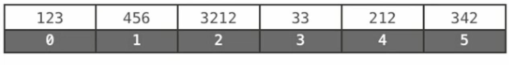
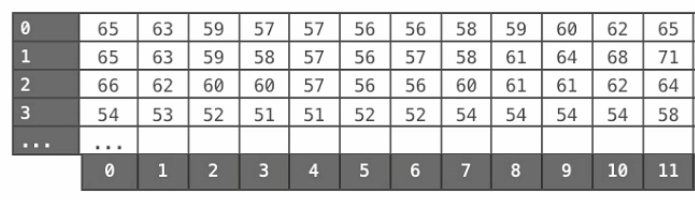
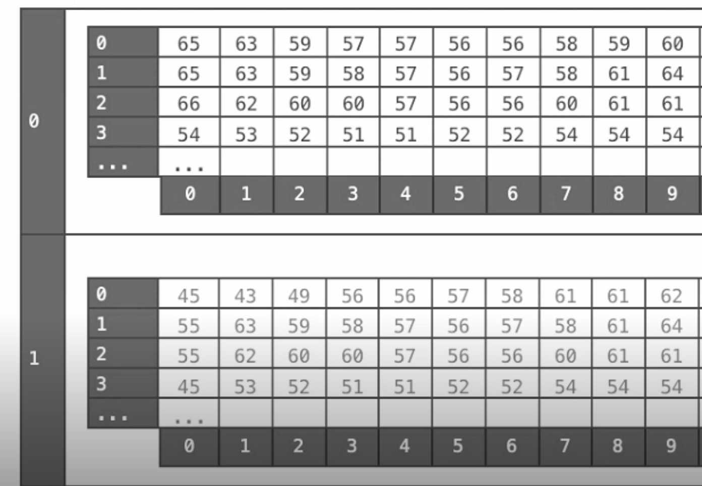

# Interview Prep Guide

[Google Tech Dev Guide](https://techdevguide.withgoogle.com/?_ga=2.205844115.1466422996.1565078662-1599821486.1565078662)

- [Data Structures](#data-structures)
	- [Arrays](#arrays)
	- [Linked Lists](#linked-lists)
	- [Stacks](https://github.com/dukhniav/Interview-Prep/blob/master/data-structures/stacks.md)
	- [Queues](https://github.com/dukhniav/Interview-Prep/blob/master/data-structures/queue.md)
	- [Hash Tables](https://github.com/dukhniav/Interview-Prep/blob/master/data-structures/hash.md)
	- [Trees](https://github.com/dukhniav/prep/blob/master/data-structures/tree.md)
	- [Heaps](https://github.com/dukhniav/Interview-Prep/blob/master/data-structures/heap.md)
	- [Graphs](https://github.com/dukhniav/Interview-Prep/blob/master/data-structures/graph.md)

## Data Structures
<details>
<summary>Arrays</summary>

#### Definition
Contiguous area of memory consisiting of equal-size elements indexed by contiguous integers.

- Fixed size (immutable)
- Specific data type
   * Can make an array of a generic `object` data-type, however, the more specific, the better.
   * **Flexibility introduces overhead**.

#### Arrays in Java
[GeeksForGeeks article](https://www.geeksforgeeks.org/arrays-in-java/)

- In Java all arrays are dynamically allocated.
- A Java array variable can also be declared like other variables with [] after the data type.
- The variables in the array are ordered and each have an index beginning from 0.
- Java array can be also be used as a static field, a local variable or a method parameter.
- The size of an array must be specified by an int value and not long or short.
- The direct superclass of an array type is Object.
- Every array type implements the interfaces Cloneable and java.io.Serializable.


- *Memory representation* - when `new` is used to create an array, Java reserves space in memory for it ( and initializes the values). Called *memory allocation*.

#### Java Array Literals
Java contains a shortcut for instantiating array of primitive types and strings. If you already know what values to insert into the array, you can use the array literal:
```java
int[] ints2 = new int[]{ 1,2,3,4,5,6,7,8 };
===
int[] ints2 = { 1,2,3,4,5,6,7,8 };
```

Notice how the values to be inserted into the array are listed inside the `{ ... }` block. The *length* of this also determines the length of the created array.

#### Iterating Arrays
Iterating through an array of `String` objects:
```java
String[] stringArray = {"one", "two", "three"};

for(String theString : stringArray) {
    System.out.println(theString);
}
```

[Coursera: Arrays (video)](https://www.coursera.org/learn/data-structures/lecture/OsBSF/arrays)
[Lynda: Basic Arrays (video)](https://archive.org/details/0102WhatYouShouldKnow/02_04-basicArrays.mp4)
[Multi-dimentional (video)](https://archive.org/details/0102WhatYouShouldKnow/02_05-multidimensionalArrays.mp4)

#### One-Dimentional Array


- Constant time access to any element.
- Constant time to add/remove at the end (memory wise)
- Linear time to add/remove to an arbitrary location (memory wise)

#### Two-Dimentional Array (Matrix)


- Array of arrays
- Need two numbers to access.

#### Multi-Dimentional Array (Jagged Array)


- Array of arrays of arrays
   * Just about grouping information together

#### ArrayList
- Resizable array (mutable) - Java
- Can be created empty, or some initial value.

- Adding new elements: Location?
    - `myArray.add(999);` - will be added to the end of the array, in constant time.
    - `myArray.add(999, 2);` - will be added to index 2, which means that all other indices will need to be moved.
    * Just because resizable arrays do the "shuffling" under the hood, doesn't mean we don't need to think about these details.

#### Appending items at end of array
| Lang | Code |
| --- | --- |
| Java | `add(value)` |
| Objective-C | `addObject:Value` |
| JavaScript | `push(value)` |
| Ruby | `push(value)` |
| Python | `append(value)` |

#### Inserting items at specific index
| Lang | Code |
| --- | --- |
| Java | `add(index,value)` |
| Objective-C | `addObject:Value atIndex:index` |
| JavaScript | `splice(index,items_to_remove,items_to_insert)` |
| Ruby | `insert(index,value)` |
| Python | `insert(index,value)` |

#### Removing items from an array
| Lang | Code |
| --- | --- |
| Java | `remove(index)` |
| Objective-C | `removeObjectAtIndex:index` |
| JavaScript | `pop / slice` |
| Ruby | `pop / delete_at` |
| Python | `pop / remove` |

\* pop -> always refers to removing the last item.


```java
// need to import
import java.util.*;

// create ArrayList of Strings
List<String> resizable = new ArrayList<String>();

// add to it
resizable.add("Hello World");
```

</details>

## Linked Lists
