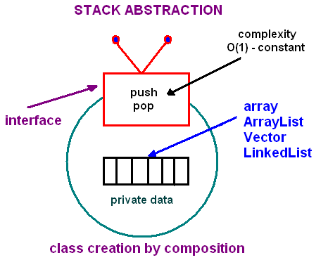
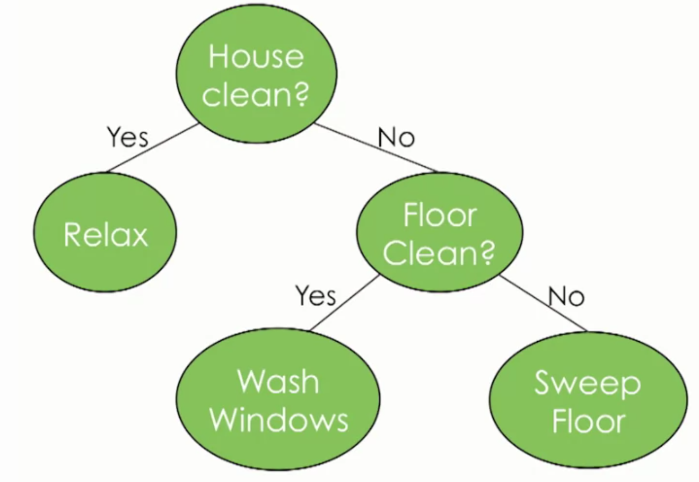
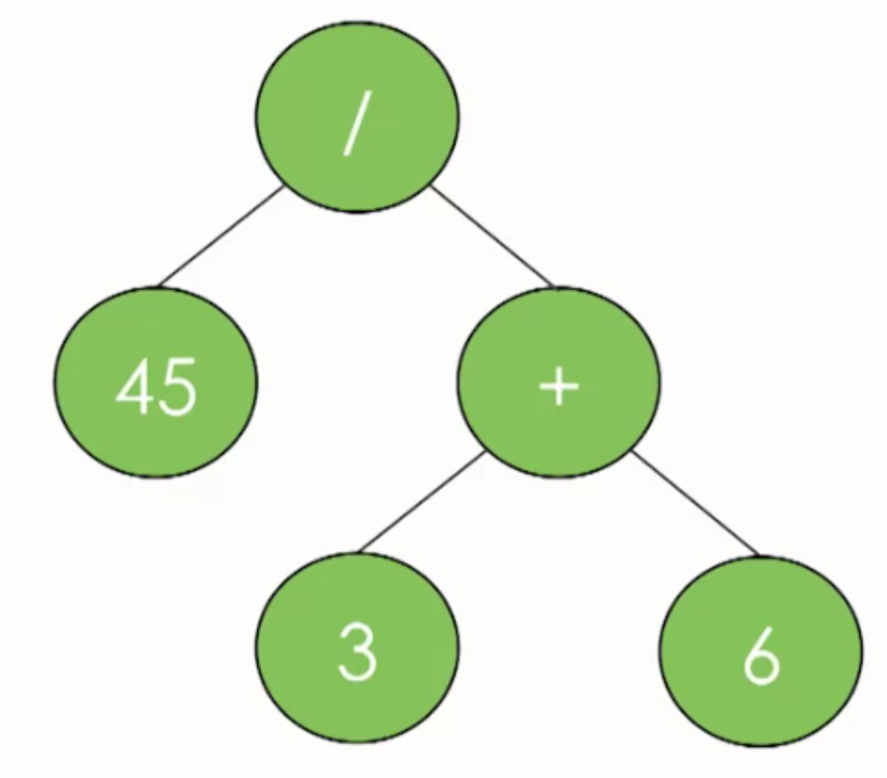
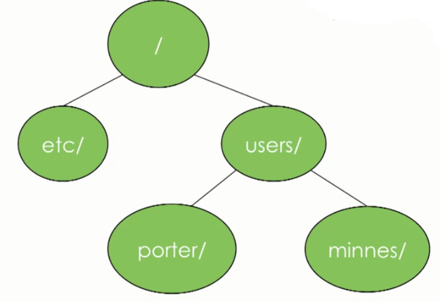
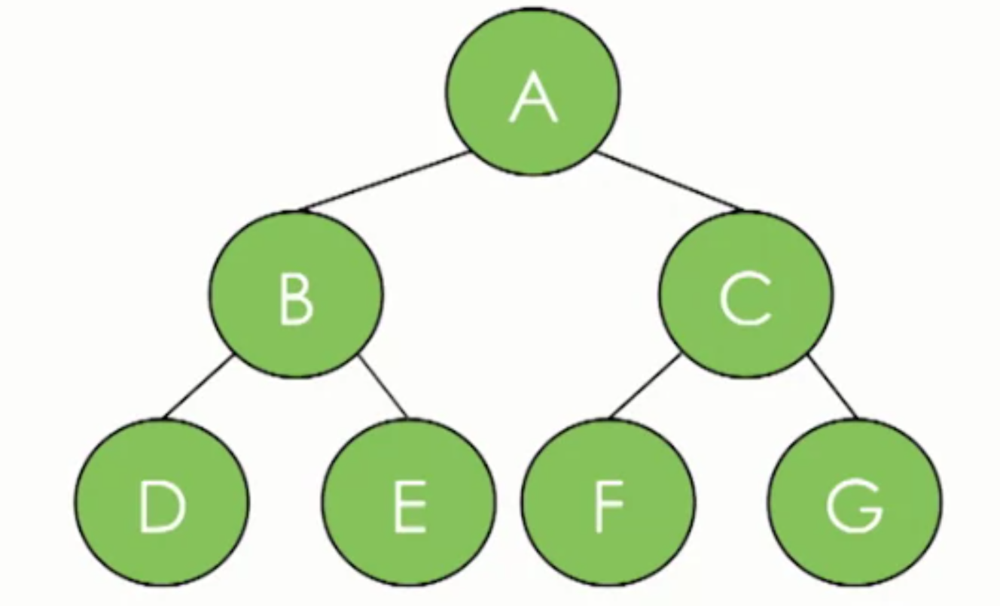

# Interview Prep Guide

[Google Tech Dev Guide](https://techdevguide.withgoogle.com/?_ga=2.205844115.1466422996.1565078662-1599821486.1565078662)

- [Data Structures](#data-structures)
	- [Arrays](#arrays)
	- [Linked Lists](#linked-lists)
	- [Stacks](#stacks)
	- [Queues](#queues)
	- [Hash Tables](#hash-tables)
		- Hashing
- [Graphs](#graphs)
	- Directed
	- Undirected
	- Breadth First Search (BFS)
	- Depth First Search (DFS)
- [Trees](#trees)
	- Binary Trees
	- Spanning Trees
	- Minimum Spanning Trees
	- AVL Trees
	- [Heaps](#heaps)
- Sorting Algorithms
	- Selection sort
	- Insertion sort
	- Merge sort
	- Quick sort
- Other Algorithms
	- Topological sort
	- Dijkstra's algorithm
	- Kruskal's algorithm
	- Prim's algorithm
- Big-O Analysis of Algorithms
	- Time Function: T(N)
	- Big-O notation
- System Design
- Networking
- Design Patterns
- Testing

## Data Structures

<hr>

<!--- ARRAYS ------------------------------------------------------------------>
### Arrays


#### Definition
Contiguous area of memory consisting of equal-size elements indexed by contiguous integers.

- Fixed size (immutable)
- Specific data type
   * Can make an array of a generic `object` data-type, however, the more specific, the better.
   * **Flexibility introduces overhead**.

#### Arrays in Java
[GeeksForGeeks article](https://www.geeksforgeeks.org/arrays-in-java/)

- In Java all arrays are dynamically allocated.
- A Java array variable can also be declared like other variables with [] after the data type.
- The variables in the array are ordered and each have an index beginning from 0.
- Java array can be also be used as a static field, a local variable or a method parameter.
- The size of an array must be specified by an int value and not long or short.
- The direct superclass of an array type is Object.
- Every array type implements the interfaces Cloneable and java.io.Serializable.


- *Memory representation* - when `new` is used to create an array, Java reserves space in memory for it ( and initializes the values). Called *memory allocation*.

#### Java Array Literals
Java contains a shortcut for instantiating array of primitive types and strings. If you already know what values to insert into the array, you can use the array literal:
```java
int[] ints2 = new int[]{ 1,2,3,4,5,6,7,8 };
===
int[] ints2 = { 1,2,3,4,5,6,7,8 };
```

Notice how the values to be inserted into the array are listed inside the `{ ... }` block. The *length* of this also determines the length of the created array.

#### Iterating Arrays
Iterating through an array of `String` objects:
```java
String[] stringArray = {"one", "two", "three"};

for(String theString : stringArray) {
    System.out.println(theString);
}
```

[Coursera: Arrays (video)](https://www.coursera.org/learn/data-structures/lecture/OsBSF/arrays)
[Lynda: Basic Arrays (video)](https://archive.org/details/0102WhatYouShouldKnow/02_04-basicArrays.mp4)
[Multi-dimentional (video)](https://archive.org/details/0102WhatYouShouldKnow/02_05-multidimensionalArrays.mp4)

#### One-Dimentional Array


- Constant time access to any element.
- Constant time to add/remove at the end (memory wise)
- Linear time to add/remove to an arbitrary location (memory wise)

#### Two-Dimentional Array (Matrix)


- Array of arrays
- Need two numbers to access.

#### Multi-Dimentional Array (Jagged Array)


- Array of arrays of arrays
   * Just about grouping information together

#### ArrayList
- Resizable array (mutable) - Java
- Can be created empty, or some initial value.

- Adding new elements: Location?
    - `myArray.add(999);` - will be added to the end of the array, in constant time.
    - `myArray.add(999, 2);` - will be added to index 2, which means that all other indices will need to be moved.
    * Just because resizable arrays do the "shuffling" under the hood, doesn't mean we don't need to think about these details.

#### Appending items at end of array
| Lang | Code |
| --- | --- |
| Java | `add(value)` |
| Objective-C | `addObject:Value` |
| JavaScript | `push(value)` |
| Ruby | `push(value)` |
| Python | `append(value)` |

#### Inserting items at specific index
| Lang | Code |
| --- | --- |
| Java | `add(index,value)` |
| Objective-C | `addObject:Value atIndex:index` |
| JavaScript | `splice(index,items_to_remove,items_to_insert)` |
| Ruby | `insert(index,value)` |
| Python | `insert(index,value)` |

#### Removing items from an array
| Lang | Code |
| --- | --- |
| Java | `remove(index)` |
| Objective-C | `removeObjectAtIndex:index` |
| JavaScript | `pop / slice` |
| Ruby | `pop / delete_at` |
| Python | `pop / remove` |

\* pop -> always refers to removing the last item.


```java
// need to import
import java.util.*;

// create ArrayList of Strings
List<String> resizable = new ArrayList<String>();

// add to it
resizable.add("Hello World");
```

<hr>

<!--- LINKED LISTS ------------------------------------------------------------>
### Linked Lists

One disadvantage of using arrays to store data is that arrays are static structures and therefore cannot be easily extended or reduced to fit the data set. Arrays are also expensive to maintain new insertions and deletions.

Linked Lists try to address some of the limitations of arrays. A linked list is a linear data structure, where each element is a separate object.


Each element (we will call it a node) of a list is comprising of two items:
* the data
* a reference to the next node
The last node has a reference to *null*. The entry point into a linked list is called the *head* of the list. It should be noted that head is not a separate node, but **the reference to the first node**. If the list is empty then the head is a null reference.

A linked list is a dynamic data structure. The number of nodes in a list is not fixed and can grow and shrink on demand. Any application which has to deal with an unknown number of objects will need to use a linked list.

|  | LinkedList | Array | Dynamic Array | Balanced Tree | Random Access List | Hashed Array Tree |
|---------------------------|--------------------------------------------------------------------|-------|----------------|---------------|--------------------|-------------------|
| Indexing | Θ(n) | Θ(1) | Θ(1) | Θ(log n) | Θ(log n) | Θ(1) |
| Insert/delete @ beginning | Θ(1) | N/A | Θ(n) | Θ(log n) | Θ(1) | Θ(n) |
| Insert/delete @ end | Θ(1) when last element is known; Θ(n) when last element is unknown | N/A | Θ(1) amortized | Θ(log n) | Θ(log n) updating | Θ(1) amortized |
| Insert/delete in middle | search time + Θ(1 | N/A | Θ(n) | Θ(log n) | Θ(log n) updating | Θ(n) |
| Wasted space (average) | Θ(n) | 0 | Θ(n) | Θ(n) | Θ(n) | Θ(√n) |

#### Disadvantages
* It does not allow direct access to the individual elements. If you want to access a particular item then you have to start at the head and follow the references until you get to that item. (*Random access*)
* Uses more memory compared to an array - extra 4 bytes (on 32-bit CPU) to store a reference to the next node.

#### Types of Linked Lists
##### Singly Linked List
(described above)

##### Doubly Linked List

Linked list which has two references, one to the *next* node, and another to the *previous* node.

##### Circular Linked List
Linked list where last node of the list points back to the first node (or the head) of the list.

#### Implementing LinkedList from scratch
Need two classes:
* Node
* CustomList

```
public class Node{
  String data;
  Node next;

  public Node(String item) {
    data = item;
  }
}

public class CustomList {
  Node head;

  public CustomList(String item) {
    head = new Node(item);
  }

  public void add(String item) {
    /*
      pseudo code: while next isn't null, walk the list
      once you reach the end, create a new LinkNode and add the item to it.  Then
      set the last LinkNode's next to this new LinkNode
    */
  }
}
```

<hr>
<!--- STACKS ------------------------------------------------------------------>

### Stacks

A stack is a basic data structure that can be logically thought of as a linear structure represented by a real physical stack or pile, a structure where insertion and deletion of items takes place at one end called top of the stack.

At any given time, we can only access the top element of a stack.

This feature makes it **LIFO** data structure. LIFO stands for Last-in-first-out. Here, the element which is placed (inserted or added) last, is accessed first.


A stack is a **recursive** data structure. Here is a structural definition of a Stack:
- a stack is either empty or
- it consists of a top and the rest which is a stack


#### Basic Operations

There are basically three operations that can be performed on stacks:
1. inserting an item onto the stack (push)
2. removing an item from the stack (pop)
3. displaying the contents of the stack (peek)

>Note:
Depending on the language and implementation the data structure may share the name with an abstract data type that support all of the data structure characteristics.

#### Implementation

In the standard library of classes, the data type stack is an adapter class, meaning that a stack is built on top of other data structures. The underlying structure for a stack could be:
-  an array,
- a vector,
- an ArrayList,
- a linked list, or
- any other collection.

Regardless of the type of the underlying data structure, a Stack must implement the same functionality. This is achieved by providing a unique interface:

```java
public interface StackInterface<AnyType>
{
   public void push(AnyType e);

   public AnyType pop();

   public AnyType peek();

   public boolean isEmpty();
}
```

The following picture demonstrates the idea of implementation by *composition*.


Another implementation requirement (in addition to the above interface) is that all stack operations must run in **constant time O(1)**. Constant time means that there is some constant k such that an operation takes k nanoseconds of computational time regardless of the stack size.


#### Example
```java
import java.util.*;

class StackDemo {
  public static void main(String[]args) {
    Stack<String> stack = new Stack<String>();
    stack.push("A");    // Insert "A" in the stack
    stack.push("B");    // Insert "B" in the stack
    stack.push("C");    // Insert "C" in the stack
    stack.push("D");    // Insert "D" in the stack
    System.out.println(stack.peek());    // Prints the top of the stack ("D")
    stack.pop();    // removing the top ("D")
    stack.pop();    // removing the next top ("C")
  }
}
```

<hr>

<!--- QUEUES ------------------------------------------------------------------>
### Queues


Queue is an abstract data structure, somewhat similar to Stacks. Unlike stacks, a queue is open at both its ends. One end is always used to insert data (enqueue) and the other is used to remove data (dequeue). Queue follows First-In-First-Out methodology, i.e., the data item stored first will be accessed first.

#### Queue Representation

>As in stacks, a queue can also be implemented using Arrays, Linked-lists, Pointers and Structures.

#### Basic Operations
Queue operations may involve initializing or defining the queue, utilizing it, and then completely erasing it from the memory.

##### enqueue()
− add (store) an item to the queue.

##### dequeue()
− remove (access) an item from the queue.

##### peek()
− Gets the element at the front of the queue without removing it.

##### isFull()
− Checks if the queue is full.

##### isEmpty()
− Checks if the queue is empty.

In queue, we always dequeue (or access) data, pointed by front pointer and while enqueing (or storing) data in the queue we take help of rear pointer.

<hr>

<!--- HASH ------------------------------------------------------------------>
### Hash Tables

A.K.A. *hash, hash map, map, unordered map, dictionary*

#### Strengths:
- **Fast lookups** - Lookups take *O(1)* time on *average*.
- **Flexible keys** - Most data types can be used for keys, as long as they're hashable.

#### Weaknesses:
- **Slow worst-case lookups** - Lookups take *O(n)* time in the worst case.
- **Unordered** - Keys aren't stored in a special order. If you're looking for the smallest key, the largest key, or all the keys in a range, you'll need to look through every key to find it.
- **Single-directional lookups** - While you can look up the value for a given key in *O(1)* time, looking up the keys for a given value requires looping through the whole dataset—*O(n)* time.
- **Not cache-friendly** - Many hash table implementations use linked lists, which don't put data next to each other in memory.

| . | Average | Worst Case |
| --- | --- | --- |
| space 	| O(n) | O(n) |
| insert |	O(1) | O(n) |
| lookup |	O(1) | O(n) |
| delete |	O(1) | O(n) |

#### Compared to other data structures
|  | LinkedList | Array | Dynamic Array | Balanced Tree | Random Access List | Hashed Array Tree |
|---------------------------|--------------------------------------------------------------------|-------|----------------|---------------|--------------------|-------------------|
| Indexing | Θ(n) | Θ(1) | Θ(1) | Θ(log n) | Θ(log n) | Θ(1) |
| Insert/delete @ beginning | Θ(1) | N/A | Θ(n) | Θ(log n) | Θ(1) | Θ(n) |
| Insert/delete @ end | Θ(1) when last element is known; Θ(n) when last element is unknown | N/A | Θ(1) amortized | Θ(log n) | Θ(log n) updating | Θ(1) amortized |
| Insert/delete in middle | search time + Θ(1 | N/A | Θ(n) | Θ(log n) | Θ(log n) updating | Θ(n) |
| Wasted space (average) | Θ(n) | 0 | Θ(n) | Θ(n) | Θ(n) | Θ(√n) |

#### In Java
 In Java, hash tables are called hash maps.
```
HashMap<String, Integer> lightBulbToHoursOfLight = new HashMap<>();

lightBulbToHoursOfLight.put("incandescent", 1200);
lightBulbToHoursOfLight.put("compact fluorescent", 10000);
lightBulbToHoursOfLight.put("LED", 50000);
```

### When hash table operations cost *O(n)* time
#### Hash collisions
If all our keys caused hash collisions, we'd be at risk of having to walk through all of our values for a single lookup (in the example above, we'd have one big linked list). This is unlikely, but it could happen. That's the worst case.

#### Dynamic array resizing
Suppose we keep adding more items to our hash map. As the number of keys and values in our hash map exceeds the number of indices in the underlying array, hash collisions become inevitable.

To mitigate this, we could expand our underlying array whenever things start to get crowded. That requires allocating a larger array and rehashing all of our existing keys to figure out their new position—*O(n)* time.


#### Basic Operations
##### Search
Searches an element in a hash table.

##### Insert
Inserts an element in a hash table.

##### Delete
Deletes an element from a hash table.

##### Methods & Descriptions
`void clear( )` - Resets and empties the hash table.

`Object clone( )` - Returns a duplicate of the invoking object.

`boolean contains(Object value)` - Returns true if some value equal to the value exists within the hash table. Returns false if the value isn't found.

`boolean containsKey(Object key)` - Returns true if some key equal to the key exists within the hash table. Returns false if the key isn't found.

`boolean containsValue(Object value)` - Returns true if some value equal to the value exists within the hash table. Returns false if the value isn't found.

`Enumeration elements( )` - Returns an enumeration of the values contained in the hash table.

`Object get(Object key)` - Returns the object that contains the value associated with the key. If the key is not in the hash table, a null object is returned.

`boolean isEmpty( )` - Returns true if the hash table is empty; returns false if it contains at least one key.

`Enumeration keys( )` - Returns an enumeration of the keys contained in the hash table.

`Object put(Object key, Object value)` - Inserts a key and a value into the hash table. Returns null if the key isn't already in the hash table; returns the previous value associated with the key if the key is already in the hash table.

`void rehash( )` - Increases the size of the hash table and rehashes all of its keys.

`Object remove(Object key)` - Removes the key and its value. Returns the value associated with the key. If the key is not in the hash table, a null object is returned.

`int size( )` - Returns the number of entries in the hash table.

`String toString( )` - Returns the string equivalent of a hash table.

#### Example
```java
import java.util.*;
public class HashTableDemo {

   public static void main(String args[]) {
      // Create a hash map
      Hashtable balance = new Hashtable();
      Enumeration names;
      String str;
      double bal;

      balance.put("Zara", new Double(3434.34));
      balance.put("Mahnaz", new Double(123.22));
      balance.put("Ayan", new Double(1378.00));
      balance.put("Daisy", new Double(99.22));
      balance.put("Qadir", new Double(-19.08));

      // Show all balances in hash table.
      names = balance.keys();

      while(names.hasMoreElements()) {
         str = (String) names.nextElement();
         System.out.println(str + ": " + balance.get(str));
      }        
      System.out.println();

      // Deposit 1,000 into Zara's account
      bal = ((Double)balance.get("Zara")).doubleValue();
      balance.put("Zara", new Double(bal + 1000));
      System.out.println("Zara's new balance: " + balance.get("Zara"));
   }
}
```
##### Output
```
Qadir: -19.08
Zara: 3434.34
Mahnaz: 123.22
Daisy: 99.22
Ayan: 1378.0

Zara's new balance: 4434.34
```

<hr>

<!--- TREES ------------------------------------------------------------------>
### Trees

Trees represent nodes connected by edges.

Unlike Arrays, Linked Lists, Stack and queues, which are linear data structures, trees are hierarchical data structures.

[Series: Core Trees (video)](https://www.coursera.org/learn/data-structures-optimizing-performance/lecture/ovovP/core-trees)

[Series: Trees (video)](https://www.coursera.org/learn/data-structures/lecture/95qda/trees)


#### Different organizations --> Different trees
- Root is most important? - Heap
- Organized by character frequency? - Huffman Tree (compression)
- Organized by node ordering? - Search Tree
- Etc...

##### decision trees


##### expression trees


Evaluate: `45 / (3 + 6)`

##### file systems


`/users/porter/`

- hierarchical data structure - great for file systems

#### Terminology
- root
  - start at the root node
  - only node that doesn't have any parents
- leaf
  - nodes without children

#### What defines a tree
- single roots
- each node can have only one parent (except root)
- no cycles in a tree

#### Binary Tree


This is the most basic basic from of tree structure. Where each node can have **at two children**.

A binary tree is made of nodes, where each node contains a "left" pointer, a "right" pointer, and a data element. The "root" pointer points to the topmost node in the tree. The left and right pointers recursively point to smaller "subtrees" on either side. A null pointer represents a binary tree with no elements -- the empty tree. The formal recursive definition is: a binary tree is either empty (represented by a null pointer), or is made of a single node, where the left and right pointers (recursive definition ahead) each point to a **binary tree**.

The nodes at the bottom edge of the tree have empty subtrees and are called "leaf" nodes (F, G, H, I, J) while the others are "internal" nodes (A, B, C, D, E).

####  Binary Search Tree Niche
Basically, binary search trees are fast at insert and lookup. The next section presents the code for these two algorithms. On average, a binary search tree algorithm can locate a node in an N node tree in order lg(N) time (log base 2). Therefore, binary search trees are good for "dictionary" problems where the code inserts and looks up information indexed by some key. The lg(N) behavior is the average case -- it's possible for a particular tree to be much slower depending on its shape.

#### Terminology
- The depth of a node is the number of edges from the root to the node.
- The height of a node is the number of edges from the node to the deepest leaf.
- The height of a tree is a height of the root.
- A full binary tree.is a binary tree in which each node has exactly zero or two children.
- A complete binary tree is a binary tree, which is completely filled, with the possible exception of the bottom level, which is filled from left to right.

#### Complete binary tree
A complete binary tree is very special tree, it provides the best possible ratio between the number of nodes and the height. The height h of a complete binary tree with N nodes is at most O(log N). We can easily prove this by counting nodes on each level, starting with the root, assuming that each level has the maximum number of nodes:

```
n = 1 + 2 + 4 + ... + 2h-1 + 2h = 2h+1 - 1
```

Solving this with respect to h, we obtain

```
h = O(log n)
```

where the big-O notation hides some superfluous details.

#### Traversals
- Depth-first traversal
  * PreOrder traversal - visit the parent first and then left and right children;
  * InOrder traversal - visit the left child, then the parent and the right child;
  * PostOrder traversal - visit left child, then the right child and then the parent;
- Breadth-first traversal
  * There is only one kind of breadth-first traversal--the level order traversal. This traversal visits nodes by levels from top to bottom and from left to right.

#### Implementation


- each node needs:
  1. a value
  2. a parent
  3. a left child
  4. a right child
- to implement a generic tree, would just have a list instead of left/right children
  - because we don't know how many leaf nodes the tree might have

#### DFS
- preOrder Traversal
- postOrder Traversal

#### BFS
Visit: `A B C D E F G`
- levelOrder Traversal
- challenging - when finish with `B`, how do we know to know to `C`
  - keep two lists:
    - *list* of nodes starting with root
    - *visited* nodes
      - while at root `A`
      - add `A` to `list`
      - remove `A` from `list` and add `A`'s children to `list`
        - add `A` to `visited`
      - remove next node from `list` --> `B` and add its children to `list`
        - remove `B` from `list` and add it to `visited`
      - etc...
  - end up using tree like a `Queue`

```java
public class BinaryTree<E> {
  TreeNode<e> root;

  /*  
      preOrder Traversal
      ------------------
      Visit current root
      Visit left subtree
      Visit right subtree
  */
  private void preOrder(TreeNode<E> node){
    if(node != null){
      node.visit();
      preOrder(node.getLeftChild());
      preOrder(node.getRightChild());
    }
  }
  // runs preOrder on root
  public void preOrder() {
    this.preOrder(root);
  }

  /*  
      postOrder Traversal
      ------------------
      Visit left subtree
      Visit right subtree
      Visit current root
  */
  private void postOrder(TreeNode<E> node){
    if(node != null){
      preOrder(node.getLeftChild());
      preOrder(node.getRightChild());
      node.visit();
    }
  }

  // run postOrder on root
  public void postOrder() {
    this.postOrder(root);
  }

  /*  
      inOrder Traversal
      ------------------
      Visit left subtree
      Visit current root
      Visit right subtree
  */
  private void inOrder(TreeNode<E> node){
    if(node != null){
      preOrder(node.getLeftChild());
      node.visit();
      preOrder(node.getRightChild());
    }
  }

  // run inOrder on root
  public void inOrder() {
    this.inOrder(root);
  }

  /*
    levelOrder Traversal (BFS)
    --------------------------
    Using LinkedLists, because LinkedLists implement Heap
  */
  public void levelOrder() {
    Queue< TreeNode<E> > q = new LinkedList < TreeNode<E> > ();
    q.add(root);
    while(!q.isEmpty()) {
      TreeNode<E> curr = q.remove();
      if(curr != null) {
        // could check for null children before adding
        curr.visit();
        q.add(curr.getLeftChild());
        q.add(curr.getRightChild());
      }
    }
  }
}

public class TreeNode<E> {
  private E value;
  private TreeNode<E> parent;
  private TreeNode<E> left;
  private TreeNode<E> right;

  // Constructor
  public TreeNode(E val, TreeNode<E> par) {
    this.value = val;
    this.parent = par;
    this.left = null;
    this.right = null;
  }

  // Setter for left child
  public TreeNode<E> addLeftChild(E val) {
    // 'this' is passed as the parent
    this.left = new TreeNode<E>(val, this);
    return this.left;
  }

  // Setter for right child
  public TreeNode<E> addRightChild(E val) {
    // 'this' is passed as the parent
    this.right = new TreeNode<E>(val, this);
    return this.right;
  }
}

```


#### Binary Search Tree


The basic idea behind this data structure is to have such a storing repository that provides the efficient way of data sorting, searching and retriving.

A BST is a binary tree where nodes are ordered in the following way:

- each node contains one key (also known as data)
- the keys in the left subtree are less then the key in its parent node, in short L < P;
- the keys in the right subtree are greater the key in its parent node, in short P < R;
- duplicate keys are not allowed.

#### Implementation

##### Insertion
The insertion procedure is quite similar to searching. We start at the root and recursively go down the tree searching for a location in a BST to insert a new node. If the element to be inserted is already in the tree, we are done (we do not insert duplicates). The new node will always replace a NULL reference.

##### Searching
Searching in a BST always starts at the root. We compare a data stored at the root with the key we are searching for (let us call it as toSearch). If the node does not contain the key we proceed either to the left or right child depending upon comparison. If the result of comparison is negative we go to the left child, otherwise - to the right child. The recursive structure of a BST yields a recursive algorithm.

Searching in a BST has O(h) worst-case runtime complexity, where h is the height of the tree. Since s binary search tree with n nodes has a minimum of O(log n) levels, it takes at least O(log n) comparisons to find a particular node. Unfortunately, a binary search tree can degenerate to a linked list, reducing the search time to O(n).

##### Deletion
Deletion is somewhat more tricky than insertion. There are several cases to consider. A node to be deleted (let us call it as toDelete)

- is not in a tree;
- is a leaf;
- as only one child;
- has two children.

If toDelete is not in the tree, there is nothing to delete. If toDelete node has only one child the procedure of deletion is identical to deleting a node from a linked list - we just bypass that node being deleted

#### AVL Tree

#### Red-Black Tree

<hr>

<!--- HEAPS ------------------------------------------------------------------>
### Heaps

A Heap is a **specialized tree-based data structure**. Therefore it’s composed of nodes. We assign the elements to nodes: every node contains exactly one element.

Also, nodes can have children. **If a node doesn’t have any children, we call it leaf**.

What makes Heaps special:

1. every node’s value must be **less or equal to all values stored in its children**
2. it’s a **complete tree**, which means it has the least possible height

Because of #1, **the least element always will be in the root of the tree**.

How we enforce these rules is implementation-dependent.

Heaps are usually used to implement priority queues because Heaps are a very efficient implementation of extracting the least (or greatest) element.

#### Heap Variants
Heap has many variants, all of them differ in some implementation details.

For example, what is described above is a **Min-Heap**, because a parent is always less than all of its children. Alternatively, in a **Max-Heap**, the parent is always greater than it’s children. Hence, the greatest element will be in the root node.

We can choose from many tree implementations. The most straightforward is a Binary Tree. **In a Binary Tree, every node can have at most two children. We call them left child and right child**.

The easiest way to enforce #2 is to use a Full Binary Tree. A Full Binary Tree follows some simple rules:

1.    if a node has only one child, that should be its left child
2.    only the rightmost node on the deepest level can have exactly one child
3.    leaves can only be on the deepest level

Some examples:
```
1        2      3        4        5        6         7         8        9       10
()       ()     ()       ()       ()       ()        ()        ()       ()       ()
        /         \     /  \     /  \     /  \      /  \      /        /        /  \
       ()         ()   ()  ()   ()  ()   ()  ()    ()  ()    ()       ()       ()  ()
                               /          \       /  \      /  \     /        /  \
                              ()          ()     ()  ()    ()  ()   ()       ()  ()
                                                                            /
                                                                           ()

```
The trees 1, 2, 4, 5 and 7 follow the rules.

Tree 3 and 6 violate the 1st rule, 8 and 9 the 2nd rule, and 10 violate the 3rd rule.

In this tutorial, we’ll focus on **Min-Heap with a Binary Tree** implementation.


#### Inserting Elements

We should implement all operations in a way, that keeps the Heap invariants. This way, we can **build the Heap with repeated insertions**, so we’ll focus on the single insert operation.

We can insert an element with the following steps:

1.    create a new leaf which is the rightmost available slot on the deepest level and store the item in that node
2.    if the element is less than it’s parent, we swap them
3.    continue with step 2, until the element is less than it’s parent or it becomes the new root

Note, that step 2 won’t violate the Heap rule, because if we replace a node’s value with a less one, it still will be less than it’s children.

Let’s see an example! We want to insert 4 into this Heap:
```
     2
    / \
   /   \
  3     6
 / \
5   7
```

The first step is to create a new leaf which stores 4:
```
     2
    / \
   /   \
  3     6
 / \   /
5   7 4
```

Since 4 is less than it’s parent, 6, we swap them:
```
     2
    / \
   /   \
  3     4
 / \   /
5   7 6
```

Now we check whether 4 is less than it’s parent or not. Since its parent is 2, we stop. The Heap is still valid, and we inserted number 4.

Let’s insert 1:
```
     2
    / \
   /   \
  3     4
 / \   / \
5   7 6   1
```

We have to swap 1 and 4:
```
     2
    / \
   /   \
  3     1
 / \   / \
5   7 6   4
```

Now we should swap 1 and 2:
```
     1
    / \
   /   \
  3     2
 / \   / \
5   7 6   4
```
Since 1 is the new root, we stop.

#### Heap Implementation in Java

Since we use a **Full Binary Tree, we can implement it with an array**: an element in the array will be a node in the tree. We mark every node with the array indices from left-to-right, from top-to-bottom the following way:
```
     0
    / \
   /   \
  1     2
 / \   /
3   4 5
```

The only thing we need is to keep track of how many elements we store in the tree. This way the index of the next element we want to insert will be the size of the array.

Using this indexing, we can calculate the index of the parent and child nodes:

-    parent: (index – 1) / 2
-    left child: 2 * index + 1
-    right child: 2 * index + 2

Since we don’t want to bother with array reallocating, we’ll simplify the implementation even more and use an *ArrayList*.

A basic Binary Tree implementation looks like this:
```java
class BinaryTree<E> {

    List<E> elements = new ArrayList<>();

    void add(E e) {
        elements.add(e);
    }

    boolean isEmpty() {
        return elements.isEmpty();
    }

    E elementAt(int index) {
        return elements.get(index);
    }

    int parentIndex(int index) {
        return (index - 1) / 2;
    }

    int leftChildIndex(int index) {
        return 2 * index + 1;
    }

    int rightChildIndex(int index) {
        return 2 * index + 2;
    }
}
```

>The code above only adds the new element to the end of the tree. Therefore, we need to traverse the new element up if necessary. We can do it with the following code:

```java
class Heap<E extends Comparable<E>> {

    // ...

    void add(E e) {
        elements.add(e);
        int elementIndex = elements.size() - 1;
        while (!isRoot(elementIndex) && !isCorrectChild(elementIndex)) {
            int parentIndex = parentIndex(elementIndex);
            swap(elementIndex, parentIndex);
            elementIndex = parentIndex;
        }
    }

    boolean isRoot(int index) {
        return index == 0;
    }

    boolean isCorrectChild(int index) {
        return isCorrect(parentIndex(index), index);
    }

    boolean isCorrect(int parentIndex, int childIndex) {
        if (!isValidIndex(parentIndex) || !isValidIndex(childIndex)) {
            return true;
        }

        return elementAt(parentIndex).compareTo(elementAt(childIndex)) < 0;
    }

    boolean isValidIndex(int index) {
        return index < elements.size();
    }

    void swap(int index1, int index2) {
        E element1 = elementAt(index1);
        E element2 = elementAt(index2);
        elements.set(index1, element2);
        elements.set(index2, element1);
    }

    // ...

}
```
>Note, that since we need to compare the elements, they need to implement java.util.Comparable.


<hr>

<!--- GRAPH ------------------------------------------------------------------>
### Graphs
