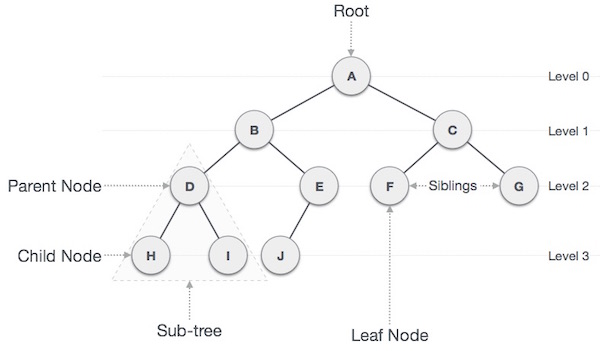

# Interview Prep Guide

[Google Tech Dev Guide](https://techdevguide.withgoogle.com/?_ga=2.205844115.1466422996.1565078662-1599821486.1565078662)

## Table of Contents

- [Data Structures](#data-structures)
  - [Arrays](#arrays)
  - [Stacks](#stacks)
  - [Queues](#queues)
  - [Priority Queues](#priority-queues)
  - [Linked Lists](#linked-lists)
  - [Hash Tables](#hash-tables)
  - [Sets](#sets)
  - [Trees](#trees)
  - [Heaps](#heaps)
  - [Graphs](#graphs)
- Recursion
- Dynamic Programming
- [Sorting Algorithms](#sorting)
  - Bubble sort
  - [Selection sort](#selection-sort)
  - [Insertion sort](#insertion-sort)
  - [Merge sort](#merge-sort)
  - [Quick sort](#quick-sort)
- Other Algorithms
- [Complexity of sorting](#complexity-of-sorting)
- Big-O Analysis of Algorithms
  - Time Function: T(N)
  - Big-O notation
- Combinatorics & Probability
- System Design
- Hardware
- Networking
- Design Patterns
- [Testing](#testing)
- Java

## Data Structures

### General Info

> Fixed structures are Faster / Smaller

###### Choose a fixed (immutable) version where possibl

- If an immutable version is needed to load, consider then copying to a mutable version for lookup.

<hr>

<!--- ARRAYS ------------------------------------------------------------------>

### Arrays

[Coursera: Arrays (video)](https://www.coursera.org/learn/data-structures/lecture/OsBSF/arrays)
[Lynda: Basic Arrays (video)](https://archive.org/details/0102WhatYouShouldKnow/02_04-basicArrays.mp4)
[Multi-dimentional (video)](https://archive.org/details/0102WhatYouShouldKnow/02_05-multidimensionalArrays.mp4)

Contiguous area of memory consisting of equal-size elements indexed by contiguous integers.

- Fixed size (immutable)
- Specific data type
  - Can make an array of a generic `object` data-type, however, the more specific, the better.
  - **Flexibility introduces overhead**.

#### Strengths

- Direct indexing
- Easy to create and use

#### Weaknesses

- Sorting and searching
- Inserting and deleting - particularly if not at start / end

#### One-Dimentional Array

- Constant time access to any element.
- Constant time to add/remove at the end (memory wise)
- Linear time to add/remove to an arbitrary location (memory wise)

#### Two-Dimentional Array (Matrix)

- Array of arrays
- Need two numbers to access.

#### Multi-Dimentional Array (Jagged Array)

- Array of arrays of arrays
  - Just about grouping information together

#### ArrayList

- Resizable array (mutable) - Java
- Can be created empty, or some initial value.

- Adding new elements: Location?
  - `myArray.add(999);` - will be added to the end of the array, in constant time.
  - `myArray.add(999, 2);` - will be added to index 2, which means that all other indices will need to be moved.
  * Just because resizable arrays do the "shuffling" under the hood, doesn't mean we don't need to think about these details.

<hr>
<!--- STACKS ------------------------------------------------------------------>

### Stacks

In a _stack_, the element deleted from the set is the one most recently inserted: the stack implements a **_last-in, first-out_**, or **_LIFO_** policy.

- The `INSERT` operation on a stack is often called `PUSH`
- The `DELETE` operation, which doesn't an element argument, is often called `POP`

#### Strengths

- Designed for LIFO

#### Weaknesses

- Direct access
- Searching and sorting

#### Time Complexity:

- Access: `O(n)`
- Search: `O(n)`
- Insert: `O(1)`
- Remove: `O(1)`

[Implementation](/implementation/stack.md#Stack-implementation)

<hr>

<!--- QUEUES ------------------------------------------------------------------>

### Queues

In a **_queue_**, the element deleted is always the one that has been in the set for the longest time: the queue implements a **_first-in, first-out_**, or **_FIFO_** policy

#### Strengths

- Designed for FIFO

#### Weaknesses

- Direct access
- Searching and sorting


> A queue implemented using an array _Q_[1..12]. Queue elements appear only in the lightly shaded positions. (**a**) The queue has 5 elements, in locations _Q_[7..11]. (**b**) The configuration of the queue after the calls ENQUEUE(_Q_,17), ENQUEUE(_Q_,3), and ENQUEUE(_Q_,5). (**c**) The configuration of the queue after the call DEQUEUE(_Q_) returns the key value 15 formerly at the head of the queue. The new head has key 6.

We call the `INSERT` operation on a queue `ENQUEUE`, and we call the `DELETE` operation `DEQUEUE`; like the stack operation `POP`, `DEQUEUE` takes no element argument. The **_FIFO_** property of a queue causes it to operate like a line of customers waiting to pay a cashier. The queue has a **_head_** and a **_tail_**. When an element is enqueued, it takes its place at the tail of the queue, just as a newly arriving customer takes a place at the end of the line. The element dequeued is always the one at the head of the queue, like the customer at the head of the line who has waited the longest.

[Implementation](/implementation/queue.md#queue-implementation)

<hr>

<!--- Priority Queues ------------------------------------------------------------>

### Priority Queues

Generalizes: stack, queue, randomized queue

| Implementation  | Time      | Space |
| --------------- | --------- | ----- |
| sort            | `N log N` | `N`   |
| elementary PQ   | `M N`     | `M`   |
| **binary heap** | `N log M` | `M`   |
| best in theory  | `N`       | `M`   |

[implementation](/implementation/priority.md#priority-queue)

<hr>

<!--- LINKED LISTS ------------------------------------------------------------>

### Linked Lists


> (**a**) A doubly linked list _L_ representing the dynamic set {4, 9, 16}. Each element in the list is an object with attributes for the key and pointers (shown by arrows) to the _next_ and previous objects. The next attribute of the tail and the _prev_ attribute of the head are `NIL`, indicated by a diagonal slash. The attribute _L.head_ points to the head. (**b**) Following the execution of `LIST-INSERT(L,x)`, where _x.key_ = 25, the linked list has a new object with key 25 as the new head. This new object points to the old head with key 9. (**c**) The result of the subsequent call `LIST-DELETE(L,x)`, where x points to the object with key 4.

##### Strengths

- Inserting and deleting elements
- Iterating through the collection

##### Weaknesses

- Direct access
- Searching and sorting

##### Time Complexity:

- Access: `O(n)`
- Search: `O(n)`
- Insert: `O(1)`
- Remove: `O(1)`

A _Linked List_ is a linear collection of data elements, called nodes, each pointing to the next node by means of a pointer. It is a data structure consisting of a group of nodes which together represent a sequence.

A **_linked list_** is a data structure in which the objects are arranged in a linear order. Unlike an array, however, in which the linear order is determined by the array indices, the order in a linked list is determined by a pointer in each object. Linked lists provide a simple, flexible representation for dynamic sets.

#### Doubly-linked list

**Doubly-linked list**: linked list in which each node has two pointers, p and n, such that p points to the previous node and n points to the next node; the last node's n pointer points to null

As shown in above figure, each element of a **_doubly linked list L_** is an object with an attribute _key_ and two other pointer attributes: _next_ and _prev_. The object may also contain other satellite data. Given an element _x_ in the list, _x.next_ points to its successor in the linked list, and _x:prev_ points to its predecessor. If _x:prev_ = NIL, the element _x_ has no predecessor and is therefore the first element, or **_head_**, of the list. If _x.next_ = NIL, the element x has no successor and is therefore the last element, or **_tail_**, of the list. An attribute _L.head_ points to the first element of the list. If _L.head_ = NIL, the list is empty.

#### Circular-linked list

**Circular-linked list**: linked list in which each node points to the next node and the last node points back to the first node

A list may have one of several forms. It may be either singly linked or doubly linked, it may be sorted or not, and it may be circular or not. If a list is **_singly linked_**, we omit the _prev_ pointer in each element. If a list is **_sorted_**, the linear order of the list corresponds to the linear order of keys stored in elements of the list; the minimum element is then the head of the list, and the maximum element is the tail. If the list is **_unsorted_**, the elements can appear in any order. In a **_circular list_**, the _prev_ pointer of the head of the list points to the tail, and the next pointer of the tail of the list points to the head. We can think of a circular list as a ring of elements. In the remainder of this section, we assume that the lists with which we are working are unsorted and doubly linked.

[Implementation](/implementation/linkedlist.md)

<hr>

<!--- HASH ------------------------------------------------------------------>

### Hash Tables

[Coursera: Phone Book Problem (video)](https://www.coursera.org/learn/data-structures/lecture/NYZZP/phone-book-problem)

A.K.A. _hash, hash map, map, unordered map, dictionary_

#### Strengths

- Speed of insertion and deletion
- Speed of access

#### Weaknesses

- Some overhead (memory)
- Retrieving in a sorted order
- Searching for a specific value

| .      | Average | Worst Case |
| ------ | ------- | ---------- |
| space  | O(n)    | O(n)       |
| insert | O(1)    | O(n)       |
| lookup | O(1)    | O(n)       |
| delete | O(1)    | O(n)       |

- Although searching for an element in a hash table can take as long as searching for an element in a linked list - &Theta;(_n_) time in the **_worst case_** , in practice, hashing performs extremely well. Under reasonable assumptions, the average time to serach for an element in a hash table is &Omicron;(1).

Unlike ordinary arrays, instead of using the key as an array index directly, the array index is _computed_ from the key.

#### Direct address tables

Direct addressing is a simple technique that works well when the amount of keys is reasonably small.

Given a set of items that have integer keys in the range [1..*m*]

- Use the value of the key itself to select a slot in the table to directly store the item
- To search for an item with key _k_, just look in slot _k_
  - If there is an item there - FOUND
  - If the tag is NIL, it does not exist

> Run time takes &Omicron;(1) time.

> Memory usage: Exponential &rarr; &Omicron;(10<sup>_k_</sup>), where _k_ is the maximum number of keys.

Limitations:

- Keys must be unique
- Keys must lie in a small range
- For storage efficiency, keys must be densein the range
- If they’re sparse(lots of gaps between values),a lot of space (memory) is needed to store the table

#### Hash tables

Downside of direct addressing: if the universe _U_ of keys is large, storing a table of size |_U_| may be impractical, or even imposible, given the memory available on a typical computer. Furthermore, the set _K_ of keys _actually stored_ may be so small relative to _U_ that most of the space allocated for the table would be wasted.

With direct addresing, an element with key _k_ is stored in slot _k_. With hashing, this element is stored in slot _h(k)_; that is, a [**_hash function_**](#hash-function) _h_ is used to compute the slot from the key _k_. Here, _h_ maps the universe _U_ of keys into the slots of a **_hash table_** _T_[0..*m* - 1]:

> _h_ : _U_ &rarr; {0, 1, ..., _m_ - 1} ,

where the size _m_ of the hash table is typically much less than |_U_|. We say that an element with key _k_ **_hashes_** to slot _h(k)_; we also say that _h(k)_ is the **_hash value_** of key _k_. The hash function reduces the range of array indices and hence the size of the array. Instead of a size of |_U_|, the array can have size _m_.

There is one hitch: two keys may hash to the same slot. This is called a **_collision_**. There are effective techniques for [resolving the conflict created by collisions](#collision-resolution)

##### Creating

#### Hash function

[Perfect hash function (wiki)](https://en.wikipedia.org/wiki/Perfect_hash_function)

> Take a complex data structure and turn it into a simple "number" (simplistic explanation)

> **_Java:_** _Default hash method will return the memory id of where the element hashed is stored in memory._

##### Java

- `Hashtable`
  - One of the older collections
  - Includes processing to stay synchronized across multiple threads
    - Good for multi-threaded applications
    - Performance cost
- `HashMap`
  - Doesn't automaticaly synchronize
  - Faster for single threaded environments
- `ConcurrentHashMap`
  - Kind of a replacement for `Hashtable`

##### Hashing in Custom Classes

- Default equality behavior checks identity (memory)
- Can be overridden to check internal state
- If you redefine equality, redefine hashing
  - If two objects are _equal_, they must return the same hash
- This behavior is already provided for **_string_** objects
  - Strings will return `equal`, if they are the equal strings and are stored in different memory locations

* Rules
  - Hashing should be deterministic under the same ontext
  - Two objects that are _equal_ should return the same hash
  - But the same hash _may_ also result from different objects
    - Hashing Collision

A good hash function satisfies (approximately) the assumption of simple uniform hashing: each key is equally likely to hash to any of the _m_ slots, independently of where any other key has hashed to. Unfortunately, we typically have no way to check this condition, since we rarely know the probability distribution from which the keys are drawn. Moreover, the keys might not be drawn independently.

Occasionally we do know the distribution. For example, if we know that the keys are random real numbers _k_ independently and uniformly distributed in the range 0 < _k_ < 1, then the hash function:

> _h(k)_ = &lfloor;_km_&rfloor;

satisfies the condition of simple uniform hashing.

##### Rolling Hash

#### Collision resolution

##### Chaining

###### Parameters

- _n_ - elements stored
- _m_ - cardinality of the hash function
- _c_ - length of the longest chain
- &Omicron;(_n + m_) - memory used
- &alpha; = _m/n_ - load factor
- Operation run in &Omicron;(_c_ + 1) time
- Want small _c_ and _m_

In _chaining_, we place all the elements that hash to the same slot into the same linked list. A slot (_j_) contains a pointer to the head of the list of all stored elements that hash to _j_ ; if there are no such elements, slot _j_ contains NIL.

##### Open Addressing

<hr>
<!--- SET ------------------------------------------------------------------>

### Sets

- [Lynda: Using sets (video)](https://archive.org/details/0102WhatYouShouldKnow/07_01-usingSets.mp4)

#### Strengths

- Checking if an object is in a collection
- Avoiding duplicates

#### Do not use for

- Direct access

A set is an **_unordered_** collection of objects.

- No index, sequence, or key
- No duplicates allowed
- Fast lookup - **_for checking membership, not retrieval_**
  - Because to check, you need to have the object already

> Sets use hash table setup

##### Java

- `HashSet`

<hr>

<!--- TREES ------------------------------------------------------------------>

### Trees

[Series: Core Trees (video)](https://www.coursera.org/learn/data-structures-optimizing-performance/lecture/ovovP/core-trees)

[Series: Trees (video)](https://www.coursera.org/learn/data-structures/lecture/95qda/trees)

[Lynda: Introduction to tree data structures (video)](https://archive.org/details/0102WhatYouShouldKnow/07_02-introductionToTreeDataStructures.mp4)

> Logical data structure

- A **_tree_** is an undirected, connnected, acyclic graph

[Implementation](/implementation/tree.md#tree-implementation)

#### Terminology

- _root node_
  - Has no parent
  - Is parent to child nodes
  - Contain links to other nodes (child nodes)
- _child nodes_
  - Nodes that have a parent
  - Each one can have own child node
- _siblings_
  - Child nodes that have the same parent
- _leaf nodes_
  - Child node with no children



#### Binary Tree vs. Binary Search Tree

##### Binary Tree

- A _Binary Tree_ is a tree data structure in which each node has at most two children, which are referred to as the _left child_ and _right child_
- **_Full Tree_**: a tree in which every node has either 0 or 2 children

- **_Complete Tree_**: a binary tree in which every level _except possibly the last_ is full and all nodes in the last level are as far left as possible

##### Binary Search Tree

- Data structure that naturaly stays sorted
- No duplicate keys
- Very efficient at retrieving data
  - at every step, discarding whole subtrees of data
- Child nodes
  - left child - must be **_LESS_** than parent
  - right child - must be **_MORE_** than parent
  - These inequalities must be true for all of a node's descendants, not just its immediate children.

> A binary search tree imposes the condition that, for each node, its left descendents are less than or equal to the current node, which is less than the right descendants.

#### Balanced vs Unbalanced

Balancing a tree doesn't mean the left and right subtrees are exaclty the same size (unlike "perfect binary trees")

- "Balanced" tree really means something more like "not terribly imbalanced". Its balanced enough to ensure _O(log n)_ times for `insert` and `find`, but it's not necessarily as balanced as it could be.

- Two common types of balanced trees:
  - Red-black trees
  - AVL trees

#### Complete binary trees

Binary tree in which every level of the tree is fully filled, except for perhaps the last level (last level filled left to right)

```
  Not a complete bin tree  |   Complete binary tree
      ()                        ()
     /  \                      /  \
   ()    ()                  ()    ()
  /  \     \                /  \   /
()   ()     ()             ()  () ()
```

#### Full binary tree

A full binary tree is a binary tree in which every node has either zero or two children.

- No nodes have only one child.

```
  Not a full bin tree  |   Full bin tree
      ()                        ()
     /  \                      /  \
   ()    ()                  ()    ()
  /  \     \                /  \
()   ()     ()            ()    ()
```

#### Perfect binary tree

A perfect binary tree is one where all interior nodes have two children and all leaf nodes are at the same laevel.

Rare in interviews and in real life -> a perfect tree must have exactly 2<sup>k</sup>-1 nodes (where _k_ is the number of levels)

> In an interview, don't assume a binary tree is perfect!

- Visually, it looks esentially:

```
     ()
    /  \
  ()    ()
 /  \  /  \
()  ()()  ()
```

#### Binary tree traversals

[Full implementation](/implementation/tree.md#traversal-implementation)

##### In-Order traversal

Visit: **_Left branch_** -> **_current node_** -> **_right branch_**

> When performed on a binary search tree, it visits the nodes in ascending order (hence the name "in-order").

```java
void inOrderTraversal(TreeNode node){
  if(node != null) {
    inOrderTraversal(node.left);
    visit(node);
    inOrderTraversal(node.right);
  }
}
```

##### Pre-Order traversal

Visit: Current node -> Left branch -> Right branch

> In this traversal, the **root is always the first node visited**.

##### Post-Order Traversal

#### AVL Tree

#### Red-Black Tree

<hr>
<!--- HEAPS ------------------------------------------------------------------>

### Heaps

- [Lynda: Using heap data structures (video)](https://archive.org/details/0102WhatYouShouldKnow/07_04-usingHeapDataStructures.mp4)

> Heaps are implemented as [Binary Trees](#binary-tree)

- Filled out:
  - Top to bottom
  - Left to right

```
()       ()       ()         ()        ()
        /        /  \       /  \      /  \
       ()       ()  ()     ()  ()    ()  ()
                          /         /  \
                         ()        ()  ()

```

#### Min Heap or Max Heap?

##### Lowest (or highest) value at the top of the heap

- Min heap rule: a child must always be **_greater than_** its parent
- Max heap rule: a child must always be **_less than_** its parent

* A heap is not a fully sorted data structure
  - Only the minimum or maximum is at the top
  - Perfect for **_priority queues_**

> **_Java_**: `Class PriorityQueue<E>`

#### Binary Heap

Array representation of a heap-ordered [complete binary tree](#complete-binary-tree).

<hr>
<!--- GRAPH ------------------------------------------------------------------>

### Graphs

[Lynda: Introduction to Graphs (video)](https://archive.org/details/0102WhatYouShouldKnow/07_05-introductionToGraphs.mp4)

Unlike Linked Lists and Trees, where:

- A node can only point to another node
- A child can only have one parent
- Each parent only has specific children
- Siblings are not linked together

A graph is a collection of nodes where:

- any node can link to any other node
- a node can link to mulitple other nodes, what ever is needed

#### Terminology

- Nodes - **_vertices_**
- Links between nodes - **_edges_**
- Directed / Undirected graphs
- Weighted graphs
  - Adding weights to edges to denote "importance"

#### Graph implementation

Situation specific

- Linked list - single directed graph
- Trees
- Heaps

<hr>

<!--- SORTING ----------------------------------------------------------------->

## Sorting

### General information:

- Which algorithms are best for sorting what data structures?

#### Stability

> A typical application: First, sort by name; **_then_** sort by section

A **_Stable_** sort preserves the relative order of items with equal keys.

- What sorting algorithms are stable:
  - Merge sort
  - Insertion sort
  - However, it could come down to code
    - `less than` vs `less then or equal to`

### Bubble Sort

### Selection Sort

- [Implementation](/implementation/selection.md#selection-sort)

[An Algorithmic Analysis of Selection Sort: Best, Worst, & Average Case (video)](https://www.youtube.com/watch?v=TNRRoYCzlFw)

#### Complexity

- Not stable

#### How it works

> Consider a pile of numbers to be sorted

- Steps: - Scan input pile (I) and select the smallest number. - Swap minimum element with value in first position - Swap next minimum element with value in second position

<hr>
<!--- Insertion sort ---------------------------------------------------------->

### Insertion sort

- Stable

#### How it works

> Consider a pile of numbers to be sorted

- Make two arbitrary piles - I: Input pile - O: Output pile
- Steps: 1. take the first item from input pile (I) and place into output pile (O) 2. take next item from I - if lower than the first item
- When to stop: - I is empty - O has all numbers in order

<hr>

### Merge sort

- [Coursera: Mergesort (video)](https://www.coursera.org/learn/algorithms-part1/lecture/ARWDq/mergesort)
- [Baeldung: Mergesort](https://www.baeldung.com/java-merge-sort)

- [Implementation](/implementation/merge.md#merge-sort-implementation)

_Mergesort_ is a [divide-and-conquer](#divide-and-conquer) algorithm. It continuously divides an array into two halves, recurses on both the left subarray and right subarray and then merges the two sorted halves

- Stable: `Yes`

* Basic plan:
  1. Divide array into two halves.
  2. _Recursively_ sort each half.
  3. Merge two halves.

_Goal_ :

#### Complexity

- Propose: Mersort uses at most _N_ lg _N_ compares and 6 _N_ lg _N_ array accesses to sort any array of size _N_.

<hr>
- Time Complexity:

- Best Case: `O(nlog(n))`
- Worst Case: `O(nlog(n))`
- Average Case: `O(nlog(n))`

As merge sort is a recursive algorithm, the time complexity can be expressed as the following recursive relation:

> `T(n) = 2T(n/2) + O(n)`

2T(n/2) corresponds to the time required to sort the sub-arrays and O(n) time to merge the entire array.

When solved, the time complexity will come to O(nLogn).

This is true for the worst, average and best case since it will always divide the array into two and then merge.

The space complexity of the algorithm is O(n) as we’re creating temporary arrays in every recursive call.

<hr>

### Quick sort

- Stable: `No`
- Time complexity:
  - Best Case: `O(nlog(n))`
  - Average Case: `O(nlog(n))`
  - Worst Case: `O(n^2)`

> Quicksort is a sorting algorithm, which, like merge-sort, is leveraging the divide-and-conquer principle. It has an average O(n log n) complexity and it’s one of the most used sorting algorithms, especially for big data volumes.

It’s **important to remember that Quicksort isn’t a stable algorithm.** A stable sorting algorithm is an algorithm where the elements with the same values appear in the same order in the sorted output as they appear in the input list.

The input list is divided into two sub-lists by an element called pivot; one sub-list with elements less than the pivot and another one with elements greater than the pivot. This process repeats for each sub-list.

Finally, all sorted sub-lists merge to form the final output.

#### Algorithm steps

1. We choose an element from the list, called the pivot. We’ll use it to divide the list into two sub-lists.
2. We reorder all the elements around the pivot – the ones with smaller value are placed before it, and all the elements greater than the pivot after it. After this step, the pivot is in its final position. This is the important partition step.
3. We apply the above steps recursively to both sub-lists on the left and right of the pivot.

As we can see, **quicksort is naturally a recursive algorithm, like every divide and conquer approach**.

Let’s take a simple example in order to better understand this algorithm.

```java
Arr[] = {5, 9, 4, 6, 5, 3}
```

1. Let’s suppose we pick 5 as the pivot for simplicity
2. We’ll first put all elements less than 5 in the first position of the array: {3, 4, 5, 6, 5, 9}
3. We’ll then repeat it for the left sub-array {3,4}, taking 3 as the pivot
4. There are no elements less than 3
5. We apply quicksort on the sub-array in the right of the pivot, i.e. {4}
6. This sub-array consists of only one sorted element
7. We continue with the right part of the original array, {6, 5, 9} until we get the final ordered array

#### Choosing the Optimal Pivot

The crucial point in QuickSort is to choose the best pivot. The middle element is, of course, the best, as it would divide the list into two equal sub-lists.

But finding the middle element from an unordered list is difficult and time-consuming, that is why we take as pivot the first element, the last element, the median or any other random element.

#### Algorithm Analysis

##### Time Complexity

In the best case, the algorithm will divide the list into two equal size sub-lists. So, the first iteration of the full n-sized list needs O(n). Sorting the remaining two sub-lists with n/2 elements takes 2\*O(n/2) each. As a result, the QuickSort algorithm has the complexity of O(n log n).

In the worst case, the algorithm will select only one element in each iteration, so O(n) + O(n-1) + … + O(1), which is equal to O(n2).

On the average QuickSort has O(n log n) complexity, making it suitable for big data volumes.

##### QuickSort vs MergeSort

Let’s discuss in which cases we should choose QuickSort over MergeSort.

Although both Quicksort and Mergesort have an average time complexity of O(n log n), Quicksort is the preferred algorithm, as it has an O(log(n)) space complexity. Mergesort, on the other hand, requires O(n) extra storage, which makes it quite expensive for arrays.

Quicksort requires to access different indices for its operations, but this access is not directly possible in linked lists, as there are no continuous blocks; therefore to access an element we have to iterate through each node from the beginning of the linked list. Also, Mergesort is implemented without extra space for LinkedLists.

In such case, overhead increases for Quicksort and Mergesort is generally preferred.

#### Conclusion

Quicksort is an elegant sorting algorithm that is very useful in most cases.

It’s generally an “in-place” algorithm, with the average time complexity of O(n log n).

Another interesting point to mention is that Java’s Arrays.sort() method uses Quicksort for sorting arrays of primitives. The implementation uses two pivots and performs much better than our simple solution, that is why for production code it’s usually better to use library methods.

#### Pseudocode

```java
/*
  low  --> Starting index
  high  --> Ending index
*/
quickSort(arr[], low, high) {
    if (low < high) {
        /*
          pi is partitioning index,
          arr[pi] is now at right place
        */
        pi = partition(arr, low, high);

        quickSort(arr, low, pi - 1);  // Before pi
        quickSort(arr, pi + 1, high); // After pi
    }
}
```

<details>
<summary>Implementation</summary>

> The first method is quickSort() which takes as parameters the array to be sorted, the first and the last index. First, we check the indices and continue only if there are still elements to be sorted.

> We get the index of the sorted pivot and use it to recursively call partition() method with the same parameters as the quickSort() method, but with different indices:

```java
public void quickSort(int arr[], int begin, int end) {
    if (begin < end) {
        int partitionIndex = partition(arr, begin, end);

        quickSort(arr, begin, partitionIndex-1);
        quickSort(arr, partitionIndex+1, end);
    }
}
```

> Let’s continue with the partition() method. For simplicity, this function takes the last element as the pivot. Then, checks each element and swaps it before the pivot if its value is smaller.

> By the end of the partitioning, all elements less then the pivot are on the left of it and all elements greater then the pivot are on the right of it. The pivot is at its final sorted position and the function returns this position:

```java
private int partition(int arr[], int begin, int end) {
    int pivot = arr[end];
    int i = (begin-1);

    for (int j = begin; j < end; j++) {
        if (arr[j] <= pivot) {
            i++;

            int swapTemp = arr[i];
            arr[i] = arr[j];
            arr[j] = swapTemp;
        }
    }

    int swapTemp = arr[i+1];
    arr[i+1] = arr[end];
    arr[end] = swapTemp;

    return i+1;
}
```

</details>

<hr>

### Radix Sort

<hr>

## Other Algorithms

<hr>

### Topological sort

<hr>

### Dijkstra's algorithm

<hr>

### Kruskal's algorithm

<hr>

### Prim's algorithm

<hr>

## Complexity of sorting

- **Computational complexity** - framework to study efficiency of algorithms for solving a particular problem _X_
- **Model of computation** - Allowable operations
- **Cost model** - Operation count(s)
- **Upper Bound** - Cost guarantee provided by **some** algorithm for _X_.
- **Lower bound** - Proven limit on cost guarantee of **all** algorhtms for _X_.
- **Optimal algorithm** - Algorithm with best possible cost guarantee for _X_.
  - "BEST" -> lower bound ~ upper bound

###Complexity results in context

- Lower bound may not hold if the algorithm has information about
  - initial order of the input
  - distribution of key values
  - representation of the keys
- Examples

  - _Partially-ordered arrays_ : Depending on theinitial order of the input, we may not need _N_ lg _N_ compares
    - Insertion sort requires only N-1 compares if input array is sorted
  - _Duplicate keys_: Depending on the input destribution of duplicates, we may not need _N_ lg _N_ compares
  - _Digital properties of keys_

<hr>

## Big-O Analysis of Algorithms

<hr>

### Time Function: T(N)

<hr>

### Big-O notation

<hr>

## Combinatorics & Probability

<hr>

## System Design

<hr>

### Scalability

<hr>

## Hardware

<hr>

## Networking

<hr>

### UDP

<hr>

### TCP/IP

<hr>

### HTTP

<hr>

### SSL

<hr>

## Design Patterns

<hr>

## Testing

### Assert

[Example](/implementation/merge.md#merging:-non-recursive-implementation)

Statement to test assumptions about program

- Helps detect logic bugs
- Documents code

If you put in the beginning of the code, assertions let you know what the code should be.

- Java assert statement: Throws exception unless boolean condition is true
  - `assert isSorted(a, lo, hi);`
- Can enable or disable at runtime: _No cost in production code_

```java
  java -ea MyProgram // enable assertions
  java -da MyProgram // disable assertions (default)
```

- Best practices
  - Use assertions to check internal invariants
  - Assume assertions will be disabled in production code (_do not use for external artument checking_)

<hr>

### Unit test

<hr>

### Mock objects

<hr>

### Integration testing

<hr>

### Dependency injection

<hr>

<!--- Java ----------------------------------------------------------------->

## Java

### Iterators

[Implementations](/implementation/java.md#advanced-java)

- What is an Iterable?
  - Has a method that returns an `Iterator`

### Comparator

- Comparator interface: sort using an **_altarnate order_**
- Required property: must be a **_total order_**
- Ex
  - sort strings by
    - natural order : `Now is the time`
    - case insensitive : `is No the time`
    - spanish : `cafe cafetero cuarto churro nubo nono`
    - british phone book : `McKinley Mackintosh`
    - ...
- Decouples the definition of the data type from the definition of what it means to compare two objects of that type

#### Comparator with system sort

[To use with Java system sort](/implementation/java.md#comparator-with-system-sort):

- Create `Comparator` object
- Pass as second argument to `Arrays.sort()`

#### Comparator with our sorting libraries

[To support comparators in our sort implementations](/implementation/java.md#comparator-with-our-sorting-libraries):

- Use `Object` instead of `Comparable`
- Pass `Comparator` to `sort` and `less()` and use it in `less()`

<hr>
