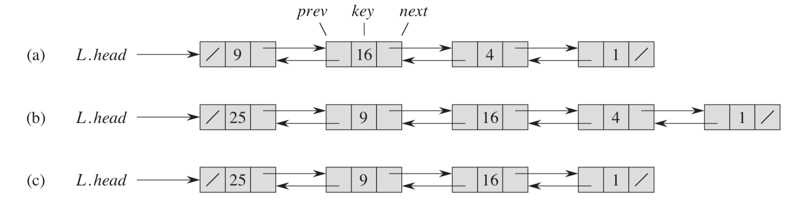

# Interview Prep Guide

[Google Tech Dev Guide](https://techdevguide.withgoogle.com/?_ga=2.205844115.1466422996.1565078662-1599821486.1565078662)

## Table of Contents

- [Data Structures](#data-structures)
  - [Arrays](#arrays)
  - [Stacks](#stacks)
  - [Queues](#queues)
  - [Linked Lists](#linked-lists)
  - [Hash Tables](#hash-tables)
    - [Hash Function](#hash-function)
    - [Collision Resolution](#collision-resolution)
  - [Sets](#sets)
  - [Trees](#trees)
    - [Binary Trees](#binary-tree)
    - [Binary Search Trees](#binary-search-tree)
    - Spanning Trees
    - Minimum Spanning Trees
    - AVL Trees
  - [Heaps](#heaps)
  - [Graphs](#graphs)
    - Directed
    - Undirected
    - [Breadth First Search (BFS)](#traversals)
    - [Depth First Search (DFS)](#traversals)
- Java
  - [Iteration](#iteration)
- Recursion
- Dynamic Programming
- [Sorting Algorithms](#sorting)
  - Bubble sort
  - [Selection sort](#selection-sort)
  - [Insertion sort](#insertion-sort)
  - Merge sort
  - Quick sort
- Other Algorithms
- Big-O Analysis of Algorithms
  - Time Function: T(N)
  - Big-O notation
- Combinatorics & Probability
- System Design
- Hardware
- Networking
- Design Patterns
- Testing

## Data Structures

### General Info

> Fixed structures are Faster / Smaller

###### Choose a fixed (immutable) version where possibl

- If an immutable version is needed to load, consider then copying to a mutable version for lookup.

<hr>

<!--- ARRAYS ------------------------------------------------------------------>

### Arrays

[Coursera: Arrays (video)](https://www.coursera.org/learn/data-structures/lecture/OsBSF/arrays)
[Lynda: Basic Arrays (video)](https://archive.org/details/0102WhatYouShouldKnow/02_04-basicArrays.mp4)
[Multi-dimentional (video)](https://archive.org/details/0102WhatYouShouldKnow/02_05-multidimensionalArrays.mp4)

Contiguous area of memory consisting of equal-size elements indexed by contiguous integers.

- Fixed size (immutable)
- Specific data type
  - Can make an array of a generic `object` data-type, however, the more specific, the better.
  - **Flexibility introduces overhead**.

#### Strengths

- Direct indexing
- Easy to create and use

#### Weaknesses

- Sorting and searching
- Inserting and deleting - particularly if not at start / end

#### One-Dimentional Array

- Constant time access to any element.
- Constant time to add/remove at the end (memory wise)
- Linear time to add/remove to an arbitrary location (memory wise)

#### Two-Dimentional Array (Matrix)

- Array of arrays
- Need two numbers to access.

#### Multi-Dimentional Array (Jagged Array)

- Array of arrays of arrays
  - Just about grouping information together

#### ArrayList

- Resizable array (mutable) - Java
- Can be created empty, or some initial value.

- Adding new elements: Location?
  - `myArray.add(999);` - will be added to the end of the array, in constant time.
  - `myArray.add(999, 2);` - will be added to index 2, which means that all other indices will need to be moved.
  * Just because resizable arrays do the "shuffling" under the hood, doesn't mean we don't need to think about these details.

<hr>
<!--- STACKS ------------------------------------------------------------------>

### Stacks

In a _stack_, the element deleted from the set is the one most recently inserted: the stack implements a **_last-in, first-out_**, or **_LIFO_** policy.

- The `INSERT` operation on a stack is often called `PUSH`
- The `DELETE` operation, which doesn't an element argument, is often called `POP`

#### Strengths

- Designed for LIFO

#### Weaknesses

- Direct access
- Searching and sorting


In above figure, a stack can be implemented of a at most _n_ elements with an array S[1..*n*]. The array has an attribute S._top_ that indexes the most recently inserted element. The stack consists of elements S[1..*S.top*], where S[1] is the element at the bottom of the stack and S[*S.top*] is the element at the top.

When S[*S.top*] = 0, the stack contains no elements and is _empty_. We can test to see whether the stack is empty by query operation `STACK-EMPTY`. If we attempt to pop an empty stack, we say the stack **_underflows_**, which is normally an error. If S[*S.top*] exceeds n, the **_stack overflows_**. (In our pseudocode implementation, we don’t worry about stack overflow.)

#### Pseudocode

`STACK-EMPTY(S)`

1. **if** _S.top_==0
2. &nbsp;&nbsp;&nbsp;&nbsp;**return** TRUE
3. **else return** FALSE

`PUSH(S,x)`

1. _S.top_ = _S.top_ + 1
2. _S_[*S.top*] = x

`POP(S)`

1. **if** STACK-EMPTY(S)
2. &nbsp;&nbsp;&nbsp;&nbsp; **error** "underflow"
3. **else** _S.top_ = _S.top_ - 1
4. &nbsp;&nbsp;&nbsp;&nbsp; **return** _S_[*S.top* + 1]

> Each of the three stack operations take _O_(1) time.

<details>
<summary>Generic stack: linked-list implementation</summary>

```java
public class Stack<item>{
  private Node first = null;

  private class Node {
    Item item;
    Node next;
  }

  public boolean isEmpty() {
    return first == null;
  }

  public void push(Item item) {
    Node oldFirst = first;
    first = new Node();
    first.item = item;
    first.next = oldFirst;
  }

  public Item pop() {
    Item item = first.item;
    first = first.next;
    return item;
  }
}

```

</details>

<hr>

<!--- QUEUES ------------------------------------------------------------------>

### Queues

In a **_queue_**, the element deleted is always the one that has been in the set for the longest time: the queue implements a **_first-in, first-out_**, or **_FIFO_** policy

#### Strengths

- Designed for FIFO

#### Weaknesses

- Direct access
- Searching and sorting


> A queue implemented using an array _Q_[1..12]. Queue elements appear only in the lightly shaded positions. (**a**) The queue has 5 elements, in locations _Q_[7..11]. (**b**) The configuration of the queue after the calls ENQUEUE(_Q_,17), ENQUEUE(_Q_,3), and ENQUEUE(_Q_,5). (**c**) The configuration of the queue after the call DEQUEUE(_Q_) returns the key value 15 formerly at the head of the queue. The new head has key 6.

We call the `INSERT` operation on a queue `ENQUEUE`, and we call the `DELETE` operation `DEQUEUE`; like the stack operation `POP`, `DEQUEUE` takes no element argument. The **_FIFO_** property of a queue causes it to operate like a line of customers waiting to pay a cashier. The queue has a **_head_** and a **_tail_**. When an element is enqueued, it takes its place at the tail of the queue, just as a newly arriving customer takes a place at the end of the line. The element dequeued is always the one at the head of the queue, like the customer at the head of the line who has waited the longest.

The figure above shows one way to implement a queue of at most _n_ - 1 elements using an array _Q_[1..*n*]. The queue has an attribute _Q.head_ that indexes, or points to, its head. The attribute _Q.tail_ indexes the next location at which a newly arriving element will be inserted into the queue. The elements in the queue reside in locations _Q.head_, _Q.head_ + 1, ..., _Q.tail_ - 1, where we “wrap around” in the sense that location 1 immediately follows location n in a circular order. When _Q.head_ = _Q.tail_, the queue is **empty**. Initially, we have _Q.head_ = _Q.tail_ = 1. If we attempt to dequeue an element from an empty queue, the queue underflows.

When _Q.head_ = _Q.tail_ + 1, the queue is full, and if we attempt to enqueue an element, then the queue overflows.
In our procedures `ENQUEUE` and `DEQUEUE`, we have omitted the error checking for underflow and overflow. The pseudocode assumes that _n_ = _Q.length_.

#### Pseudocode

`ENQUEUE(Q,x)`

1. _Q_[*Q.tail*] = x
2. **if** _Q.tail_ == _Q.length_
3. &nbsp;&nbsp;&nbsp;&nbsp;_Q.tail_ = 1
4. **else** _Q.tail_ = _Q.tail_ + 1

`DEQUEUE(Q)`

1. x = _Q_[*Q.head*]
2. **if** _Q.head_ == _Q.length_
3. &nbsp;&nbsp;&nbsp;&nbsp;_Q.head_ = 1
4. **else** _Q.head_ = _Q.head_ + 1
5. **return** x

<hr>

<!--- LINKED LISTS ------------------------------------------------------------>

### Linked Lists



> (**a**) A doubly linked list _L_ representing the dynamic set {4, 9, 16}. Each element in the list is an object with attributes for the key and pointers (shown by arrows) to the _next_ and previous objects. The next attribute of the tail and the _prev_ attribute of the head are `NIL`, indicated by a diagonal slash. The attribute _L.head_ points to the head. (**b**) Following the execution of `LIST-INSERT(L,x)`, where _x.key_ = 25, the linked list has a new object with key 25 as the new head. This new object points to the old head with key 9. (**c**) The result of the subsequent call `LIST-DELETE(L,x)`, where x points to the object with key 4.

#### Strengths

- Inserting and deleting elements
- Iterating through the collection

#### Weaknesses

- Direct access
- Searching and sorting

A **_linked list_** is a data structure in which the objects are arranged in a linear order. Unlike an array, however, in which the linear order is determined by the array indices, the order in a linked list is determined by a pointer in each object. Linked lists provide a simple, flexible representation for dynamic sets.

As shown in above figure, each element of a **_doubly linked list L_** is an object with an attribute _key_ and two other pointer attributes: _next_ and _prev_. The object may also contain other satellite data. Given an element _x_ in the list, _x.next_ points to its successor in the linked list, and _x:prev_ points to its predecessor. If _x:prev_ = NIL, the element _x_ has no predecessor and is therefore the first element, or **_head_**, of the list. If _x.next_ = NIL, the element x has no successor and is therefore the last element, or **_tail_**, of the list. An attribute _L.head_ points to the first element of the list. If _L.head_ = NIL, the list is empty.

A list may have one of several forms. It may be either singly linked or doubly linked, it may be sorted or not, and it may be circular or not. If a list is **_singly linked_**, we omit the _prev_ pointer in each element. If a list is **_sorted_**, the linear order of the list corresponds to the linear order of keys stored in elements of the list; the minimum element is then the head of the list, and the maximum element is the tail. If the list is **_unsorted_**, the elements can appear in any order. In a **_circular list_**, the _prev_ pointer of the head of the list points to the tail, and the next pointer of the tail of the list points to the head. We can think of a circular list as a ring of elements. In the remainder of this section, we assume that the lists with which we are working are unsorted and doubly linked.

#### Procedures

##### Searching a Linked List

The procedure `LIST-SEARCH(L,k)` finds the first element with key _k_ in list _L_ by a simple linear search, returning a pointer to this element. If no object with key _k_ appears in the list, then the procedure returns NIL. For the linked list in above figure (**a**), the call `LIST-SEARCH(L,4)` returns a pointer to the third element, and the call `LIST-SEARCH(L,7)` returns NIL.

`LIST-SEARCH(L,k)`

1. x = _L.head_
2. **while** _x_ &#8800; NIL and _x.key_ &#8800; _k_
3. &nbsp;&nbsp;&nbsp;&nbsp;_x_ = _x.next_
4. **return** _x_

To search a list of n objects, the `LIST-SEARCH` procedure takes &Theta;(_n_) time in the **worst case**, since it may have to search the entire list.

##### Inserting into a linked list

Given an element x whose _key_ attribute has already been set, the `LIST-INSERT` procedure “splices” x onto the front of the linked list, as shown above figure (**b**).

`LIST-INSERT(L,x)`

1. _x.next_ = _L.head_
2. **if** _L.head_ &#8800; NIL
3. &nbsp;&nbsp;&nbsp;&nbsp;_L.head.prev_ = _x_
4. _L.head_ = _x_
5. _x.prev_ = NIL

(Recall that our attribute notation can cascade, so that _L.head.prev_ denotes the _prev_ attribute of the object that _L.head_ points to.) The **running time** for `LIST-INSERT` on a list of _n_ elements is &Omicron;(1).

#####Deleting from a linked list
The procedure `LIST-DELETE` removes an element _x_ from a linked list _L_. It must be given a pointer to _x_, and it then “splices” _x_ out of the list by updating pointers. If we wish to delete an element with a given key, we must first call `LIST-SEARCH` to retrieve a pointer to the element.

`LIST-DELETE(L,x)`

1. **if** _x.prev_ &#8800; NIL
2. &nbsp;&nbsp;&nbsp;&nbsp;_x.prev.next_ = _x.next_
3. **else** _L.head_ = _x.next_
4. **if** _x.next_ &#8800; NIL
5. &nbsp;&nbsp;&nbsp;&nbsp;_x.next.prev_ = _x.prev_

Above figure shows how an element is deleted from a linked list. `LIST-DELETE` runs in &Omicron;(1) time, but if we wish to delete an element with a given key, &Theta;(_n_) time is required in the worst case because we must first call `LIST-SEARCH` to find the element.

<hr>

<!--- HASH ------------------------------------------------------------------>

### Hash Tables

[Coursera: Phone Book Problem (video)](https://www.coursera.org/learn/data-structures/lecture/NYZZP/phone-book-problem)

A.K.A. _hash, hash map, map, unordered map, dictionary_

#### Strengths

- Speed of insertion and deletion
- Speed of access

#### Weaknesses

- Some overhead (memory)
- Retrieving in a sorted order
- Searching for a specific value

| .      | Average | Worst Case |
| ------ | ------- | ---------- |
| space  | O(n)    | O(n)       |
| insert | O(1)    | O(n)       |
| lookup | O(1)    | O(n)       |
| delete | O(1)    | O(n)       |

- Although searching for an element in a hash table can take as long as searching for an element in a linked list - &Theta;(_n_) time in the **_worst case_** , in practice, hashing performs extremely well. Under reasonable assumptions, the average time to serach for an element in a hash table is &Omicron;(1).

Unlike ordinary arrays, instead of using the key as an array index directly, the array index is _computed_ from the key.

#### Direct address tables

Direct addressing is a simple technique that works well when the amount of keys is reasonably small.

Given a set of items that have integer keys in the range [1..*m*]

- Use the value of the key itself to select a slot in the table to directly store the item
- To search for an item with key _k_, just look in slot _k_
  - If there is an item there - FOUND
  - If the tag is NIL, it does not exist

> Run time takes &Omicron;(1) time.

> Memory usage: Exponential &rarr; &Omicron;(10<sup>_k_</sup>), where _k_ is the maximum number of keys.

Limitations:

- Keys must be unique
- Keys must lie in a small range
- For storage efficiency, keys must be densein the range
- If they’re sparse(lots of gaps between values),a lot of space (memory) is needed to store the table

#### Hash tables

Downside of direct addressing: if the universe _U_ of keys is large, storing a table of size |_U_| may be impractical, or even imposible, given the memory available on a typical computer. Furthermore, the set _K_ of keys _actually stored_ may be so small relative to _U_ that most of the space allocated for the table would be wasted.

With direct addresing, an element with key _k_ is stored in slot _k_. With hashing, this element is stored in slot _h(k)_; that is, a [**_hash function_**](#hash-function) _h_ is used to compute the slot from the key _k_. Here, _h_ maps the universe _U_ of keys into the slots of a **_hash table_** _T_[0..*m* - 1]:

> _h_ : _U_ &rarr; {0, 1, ..., _m_ - 1} ,

where the size _m_ of the hash table is typically much less than |_U_|. We say that an element with key _k_ **_hashes_** to slot _h(k)_; we also say that _h(k)_ is the **_hash value_** of key _k_. The hash function reduces the range of array indices and hence the size of the array. Instead of a size of |_U_|, the array can have size _m_.

There is one hitch: two keys may hash to the same slot. This is called a **_collision_**. There are effective techniques for [resolving the conflict created by collisions](#collision-resolution)

##### Creating

#### Hash function

[Perfect hash function (wiki)](https://en.wikipedia.org/wiki/Perfect_hash_function)

> Take a complex data structure and turn it into a simple "number" (simplistic explanation)

> **_Java:_** _Default hash method will return the memory id of where the element hashed is stored in memory._

##### Java

- `Hashtable`
  - One of the older collections
  - Includes processing to stay synchronized across multiple threads
    - Good for multi-threaded applications
    - Performance cost
- `HashMap`
  - Doesn't automaticaly synchronize
  - Faster for single threaded environments
- `ConcurrentHashMap`
  - Kind of a replacement for `Hashtable`

##### Hashing in Custom Classes

- Default equality behavior checks identity (memory)
- Can be overridden to check internal state
- If you redefine equality, redefine hashing
  - If two objects are _equal_, they must return the same hash
- This behavior is already provided for **_string_** objects
  - Strings will return `equal`, if they are the equal strings and are stored in different memory locations

* Rules
  - Hashing should be deterministic under the same ontext
  - Two objects that are _equal_ should return the same hash
  - But the same hash _may_ also result from different objects
    - Hashing Collision

A good hash function satisfies (approximately) the assumption of simple uniform hashing: each key is equally likely to hash to any of the _m_ slots, independently of where any other key has hashed to. Unfortunately, we typically have no way to check this condition, since we rarely know the probability distribution from which the keys are drawn. Moreover, the keys might not be drawn independently.

Occasionally we do know the distribution. For example, if we know that the keys are random real numbers _k_ independently and uniformly distributed in the range 0 < _k_ < 1, then the hash function:

> _h(k)_ = &lfloor;_km_&rfloor;

satisfies the condition of simple uniform hashing.

##### Rolling Hash

#### Collision resolution

##### Chaining

###### Parameters

- _n_ - elements stored
- _m_ - cardinality of the hash function
- _c_ - length of the longest chain
- &Omicron;(_n + m_) - memory used
- &alpha; = _m/n_ - load factor
- Operation run in &Omicron;(_c_ + 1) time
- Want small _c_ and _m_

In _chaining_, we place all the elements that hash to the same slot into the same linked list. A slot (_j_) contains a pointer to the head of the list of all stored elements that hash to _j_ ; if there are no such elements, slot _j_ contains NIL.

##### Open Addressing

<hr>
<!--- SET ------------------------------------------------------------------>

### Sets

- [Lynda: Using sets (video)](https://archive.org/details/0102WhatYouShouldKnow/07_01-usingSets.mp4)

#### Strengths

- Checking if an object is in a collection
- Avoiding duplicates

#### Do not use for

- Direct access

A set is an **_unordered_** collection of objects.

- No index, sequence, or key
- No duplicates allowed
- Fast lookup - **_for checking membership, not retrieval_**
  - Because to check, you need to have the object already

> Sets use hash table setup

##### Java

- `HashSet`

<hr>

<!--- TREES ------------------------------------------------------------------>

### Trees

[Series: Core Trees (video)](https://www.coursera.org/learn/data-structures-optimizing-performance/lecture/ovovP/core-trees)

[Series: Trees (video)](https://www.coursera.org/learn/data-structures/lecture/95qda/trees)

[Lynda: Introduction to tree data structures (video)](https://archive.org/details/0102WhatYouShouldKnow/07_02-introductionToTreeDataStructures.mp4)

> Logical data structure

#### Strengths

- Speed of insertion and deletion
- Speed of access
- Maintaining sorted order

#### Weaknesses

- Some overhead

#### Terminology


- _root node_
  - Has no parent
  - Is parent to child nodes
  - Contain links to other nodes (child nodes)
- _child nodes_
  - Nodes that have a parent
  - Each one can have own child node
- _siblings_
  - Child nodes that have the same parent
- _leaf nodes_
  - Child node with no children

#### Binary Tree

A tree structure with a maximum of **_two_** child nodes from any other node.

- Could be one
- Could be none (_leaf_)

##### Binary Search Tree

- Data structure that naturaly stays sorted
- No duplicate keys

- Very efficient at retrieving data

  - at every step, discarding whole subtrees of data

- Child nodes
  - left child - must be _LESS_ than parent
  - right child - must be _MORE_ than parent

> **_Java_**: `TreeMap`

#### Complete binary tree

A complete binary tree is very special tree, it provides the best possible ratio between the number of nodes and the height. The height h of a complete binary tree with N nodes is at most O(log N). We can easily prove this by counting nodes on each level, starting with the root, assuming that each level has the maximum number of nodes:

`n = 1 + 2 + 4 + ... + 2h-1 + 2h = 2h+1 - 1`

Solving this with respect to h, we obtain

`h = O(log n)`

where the big-O notation hides some superfluous details.

##### Traversals

- Depth-first traversal
  - PreOrder traversal - visit the parent first and then left and right children;
  - InOrder traversal - visit the left child, then the parent and the right child;
  - PostOrder traversal - visit left child, then the right child and then the parent;
- Breadth-first traversal
  - There is only one kind of breadth-first traversal--the level order traversal. This traversal visits nodes by levels from top to bottom and from left to right.

##### Implementation


- each node needs:
  1. a value
  2. a parent
  3. a left child
  4. a right child
- to implement a generic tree, would just have a list instead of left/right children
  - because we don't know how many leaf nodes the tree might have

###### DFS

- preOrder Traversal
- postOrder Traversal

###### BFS

Visit: `A B C D E F G`

- levelOrder Traversal
- challenging - when finish with `B`, how do we know to know to `C`
  - keep two lists:
    - _list_ of nodes starting with root
    - _visited_ nodes
      - while at root `A`
      - add `A` to `list`
      - remove `A` from `list` and add `A`'s children to `list`
        - add `A` to `visited`
      - remove next node from `list` --> `B` and add its children to `list`
        - remove `B` from `list` and add it to `visited`
      - etc...
  - end up using tree like a `Queue`

<details>
<summary>Implementation</summary>

```java
public class BinaryTree<E> {
  TreeNode<e> root;

  /*
      preOrder Traversal
      ------------------
      Visit current root
      Visit left subtree
      Visit right subtree
  */
  private void preOrder(TreeNode<E> node){
    if(node != null){
      node.visit();
      preOrder(node.getLeftChild());
      preOrder(node.getRightChild());
    }
  }
  // runs preOrder on root
  public void preOrder() {
    this.preOrder(root);
  }

  /*
      postOrder Traversal
      ------------------
      Visit left subtree
      Visit right subtree
      Visit current root
  */
  private void postOrder(TreeNode<E> node){
    if(node != null){
      preOrder(node.getLeftChild());
      preOrder(node.getRightChild());
      node.visit();
    }
  }

  // run postOrder on root
  public void postOrder() {
    this.postOrder(root);
  }

  /*
      inOrder Traversal
      ------------------
      Visit left subtree
      Visit current root
      Visit right subtree
  */
  private void inOrder(TreeNode<E> node){
    if(node != null){
      preOrder(node.getLeftChild());
      node.visit();
      preOrder(node.getRightChild());
    }
  }

  // run inOrder on root
  public void inOrder() {
    this.inOrder(root);
  }

  /*
    levelOrder Traversal (BFS)
    --------------------------
    Using LinkedLists, because LinkedLists implement Heap
  */
  public void levelOrder() {
    Queue< TreeNode<E> > q = new LinkedList < TreeNode<E> > ();
    q.add(root);
    while(!q.isEmpty()) {
      TreeNode<E> curr = q.remove();
      if(curr != null) {
        // could check for null children before adding
        curr.visit();
        q.add(curr.getLeftChild());
        q.add(curr.getRightChild());
      }
    }
  }
}

public class TreeNode<E> {
  private E value;
  private TreeNode<E> parent;
  private TreeNode<E> left;
  private TreeNode<E> right;

  // Constructor
  public TreeNode(E val, TreeNode<E> par) {
    this.value = val;
    this.parent = par;
    this.left = null;
    this.right = null;
  }

  // Setter for left child
  public TreeNode<E> addLeftChild(E val) {
    // 'this' is passed as the parent
    this.left = new TreeNode<E>(val, this);
    return this.left;
  }

  // Setter for right child
  public TreeNode<E> addRightChild(E val) {
    // 'this' is passed as the parent
    this.right = new TreeNode<E>(val, this);
    return this.right;
  }
}

```

</details>

#### AVL Tree

#### Red-Black Tree

<hr>
<!--- HEAPS ------------------------------------------------------------------>

### Heaps

- [Lynda: Using heap data structures (video)](https://archive.org/details/0102WhatYouShouldKnow/07_04-usingHeapDataStructures.mp4)

> Heaps are implemented as [Binary Trees](#binary-tree)

- Filled out:
  - Top to bottom
  - Left to right

```
()       ()       ()         ()        ()
        /        /  \       /  \      /  \
       ()       ()  ()     ()  ()    ()  ()
                          /         /  \
                         ()        ()  ()

```

#### Min Heap or Max Heap?

##### Lowest (or highest) value at the top of the heap

- Min heap rule: a child must always be **_greater than_** its parent
- Max heap rule: a child must always be **_less than_** its parent

- A heap is not a fully sorted data structure
  - Only the minimum or maximum is at the top
  - Perfect for **_priority queues_**

> **_Java_**: `Class PriorityQueue<E>`

<hr>
<!--- GRAPH ------------------------------------------------------------------>

### Graphs

[Lynda: Introduction to Graphs (video)](https://archive.org/details/0102WhatYouShouldKnow/07_05-introductionToGraphs.mp4)

Unlike Linked Lists and Trees, where:

- A node can only point to another node
- A child can only have one parent
- Each parent only has specific children
- Siblings are not linked together

A graph is a collection of nodes where:

- any node can link to any other node
- a node can link to mulitple other nodes, what ever is needed

#### Terminology

- Nodes - **_vertices_**
- Links between nodes - **_edges_**
- Directed / Undirected graphs
- Weighted graphs
  - Adding weights to edges to denote "importance"

#### Graph implementation

Situation specific

- Linked list - single directed graph
- Trees
- Heaps

<hr>
<!--- Java ----------------------------------------------------------------->

## Java

### Iterators

- What is an Iterable?
  - Has a method that returns an `Iterator`

```java
public interface Iterable<item> {
  Iterator<item> iterator();
}
```

- What is an Iterator?
  - Has methods `hasNext()` and `next()`.

```java
public interface Iterable<item> {
  boolean hasNext();
  Item next();
}
```

- Why make data structures Iterable?
  - Java supports elegant client code.
    > "foreach" statement (shorthand):

```java
for (String s : stack)
  StdOut.println(s);
```

> equivalent code (longhand):

```java
Iterator<String> i = stack.iterator();
while (i.hasNext()) {
  String s = i.next();
  StdOut.println(s);
}
```

<hr>
<!--- SORTING ----------------------------------------------------------------->

## Sorting

General information:

- Which algorithms are best for sorting what data structures?

### Bubble Sort

### Selection Sort

[An Algorithmic Analysis of Selection Sort: Best, Worst, & Average Case (video)](https://www.youtube.com/watch?v=TNRRoYCzlFw)

#### How it works

> Consider a pile of numbers to be sorted

- Steps: - Scan input pile (I) and select the smallest number. - Swap minimum element with value in first position - Swap next minimum element with value in second position

#### Pseudocode

```
for i = n down to 2 do
	k <- 1									// front of array
	for j = 2 to i do				// next position after front
		if A[j] > A[k] then 	// comparison
			k <- j
		end if
	end for
	A[k] <-> A[i] 					// swap
end for
```

<hr>
<!--- Insertion sort ---------------------------------------------------------->

### Insertion sort

#### How it works

> Consider a pile of numbers to be sorted

- Make two arbitrary piles - I: Input pile - O: Output pile
- Steps: 1. take the first item from input pile (I) and place into output pile (O) 2. take next item from I - if lower than the first item
- When to stop: - I is empty - O has all numbers in order

### Merge Sort

### Quick Sort

### Radix Sort

## Other Algorithms

### Topological sort

### Dijkstra's algorithm

### Kruskal's algorithm

### Prim's algorithm

## Big-O Analysis of Algorithms

### Time Function: T(N)

### Big-O notation

## Combinatorics & Probability

## System Design

### Scalability

## Hardware

## Networking

### UDP

### TCP/IP

### HTTP

### SSL

## Design Patterns

## Testing

### Unit test

### Mock objects

### Integration testing

### Dependency injection
