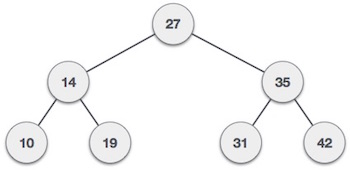

# Trees

Trees represent nodes connected by edges.

Unlike Arrays, Linked Lists, Stack and queues, which are linear data structures, trees are hierarchical data structures.

[Series: Core Trees (video)](https://www.coursera.org/learn/data-structures-optimizing-performance/lecture/ovovP/core-trees)

[Series: Trees (video)](https://www.coursera.org/learn/data-structures/lecture/95qda/trees)


#### Different organizations --> Different trees
- Root is most important? - Heap
- Organized by character frequency? - Huffman Tree (compression)
- Organized by node ordering? - Search Tree
- Etc...

### decision trees


### expression trees


Evaluate: `45 / (3 + 6)`

### file systems


`/users/porter/`

- hierarchical data structure - great for file systems

## Tree Data Structure
### Terminology
- root
  - start at the root node
  - only node that doesn't have any parents
- leaf
  - nodes without children

#### What defines a tree
- single roots
- each node can have only one parent (except root)
- no cycles in a tree

# Binary Tree


This is the most basic basic from of tree structure. Where each node can have **at two children**.

A binary tree is made of nodes, where each node contains a "left" pointer, a "right" pointer, and a data element. The "root" pointer points to the topmost node in the tree. The left and right pointers recursively point to smaller "subtrees" on either side. A null pointer represents a binary tree with no elements -- the empty tree. The formal recursive definition is: a binary tree is either empty (represented by a null pointer), or is made of a single node, where the left and right pointers (recursive definition ahead) each point to a **binary tree**.

The nodes at the bottom edge of the tree have empty subtrees and are called "leaf" nodes (F, G, H, I, J) while the others are "internal" nodes (A, B, C, D, E).

###  Binary Search Tree Niche
Basically, binary search trees are fast at insert and lookup. The next section presents the code for these two algorithms. On average, a binary search tree algorithm can locate a node in an N node tree in order lg(N) time (log base 2). Therefore, binary search trees are good for "dictionary" problems where the code inserts and looks up information indexed by some key. The lg(N) behavior is the average case -- it's possible for a particular tree to be much slower depending on its shape.

### Terminology
- The depth of a node is the number of edges from the root to the node.
- The height of a node is the number of edges from the node to the deepest leaf.
- The height of a tree is a height of the root.
- A full binary tree.is a binary tree in which each node has exactly zero or two children.
- A complete binary tree is a binary tree, which is completely filled, with the possible exception of the bottom level, which is filled from left to right.

#### Complete binary tree
A complete binary tree is very special tree, it provides the best possible ratio between the number of nodes and the height. The height h of a complete binary tree with N nodes is at most O(log N). We can easily prove this by counting nodes on each level, starting with the root, assuming that each level has the maximum number of nodes:

```
n = 1 + 2 + 4 + ... + 2h-1 + 2h = 2h+1 - 1
```

Solving this with respect to h, we obtain

```
h = O(log n)
```

where the big-O notation hides some superfluous details.

### Traversals
- Depth-first traversal
  * PreOrder traversal - visit the parent first and then left and right children;
  * InOrder traversal - visit the left child, then the parent and the right child;
  * PostOrder traversal - visit left child, then the right child and then the parent;
- Breadth-first traversal
  * There is only one kind of breadth-first traversal--the level order traversal. This traversal visits nodes by levels from top to bottom and from left to right.

### Implementation


- each node needs:
  1. a value
  2. a parent
  3. a left child
  4. a right child
- to implement a generic tree, would just have a list instead of left/right children
  - because we don't know how many leaf nodes the tree might have

#### DFS
- preOrder Traversal
- postOrder Traversal

#### BFS
Visit: `A B C D E F G`
- levelOrder Traversal
- challenging - when finish with `B`, how do we know to know to `C`
  - keep two lists:
    - *list* of nodes starting with root
    - *visited* nodes
      - while at root `A`
      - add `A` to `list`
      - remove `A` from `list` and add `A`'s children to `list`
        - add `A` to `visited`
      - remove next node from `list` --> `B` and add its children to `list`
        - remove `B` from `list` and add it to `visited`
      - etc...
  - end up using tree like a `Queue`

```java
public class BinaryTree<E> {
  TreeNode<e> root;

  /*  
      preOrder Traversal
      ------------------
      Visit current root
      Visit left subtree
      Visit right subtree
  */
  private void preOrder(TreeNode<E> node){
    if(node != null){
      node.visit();
      preOrder(node.getLeftChild());
      preOrder(node.getRightChild());
    }
  }
  // runs preOrder on root
  public void preOrder() {
    this.preOrder(root);
  }

  /*  
      postOrder Traversal
      ------------------
      Visit left subtree
      Visit right subtree
      Visit current root
  */
  private void postOrder(TreeNode<E> node){
    if(node != null){
      preOrder(node.getLeftChild());
      preOrder(node.getRightChild());
      node.visit();
    }
  }

  // run postOrder on root
  public void postOrder() {
    this.postOrder(root);
  }

  /*  
      inOrder Traversal
      ------------------
      Visit left subtree
      Visit current root
      Visit right subtree
  */
  private void inOrder(TreeNode<E> node){
    if(node != null){
      preOrder(node.getLeftChild());
      node.visit();
      preOrder(node.getRightChild());
    }
  }

  // run inOrder on root
  public void inOrder() {
    this.inOrder(root);
  }

  /*
    levelOrder Traversal (BFS)
    --------------------------
    Using LinkedLists, because LinkedLists implement Heap
  */
  public void levelOrder() {
    Queue< TreeNode<E> > q = new LinkedList < TreeNode<E> > ();
    q.add(root);
    while(!q.isEmpty()) {
      TreeNode<E> curr = q.remove();
      if(curr != null) {
        // could check for null children before adding
        curr.visit();
        q.add(curr.getLeftChild());
        q.add(curr.getRightChild());
      }
    }
  }
}

public class TreeNode<E> {
  private E value;
  private TreeNode<E> parent;
  private TreeNode<E> left;
  private TreeNode<E> right;

  // Constructor
  public TreeNode(E val, TreeNode<E> par) {
    this.value = val;
    this.parent = par;
    this.left = null;
    this.right = null;
  }

  // Setter for left child
  public TreeNode<E> addLeftChild(E val) {
    // 'this' is passed as the parent
    this.left = new TreeNode<E>(val, this);
    return this.left;
  }

  // Setter for right child
  public TreeNode<E> addRightChild(E val) {
    // 'this' is passed as the parent
    this.right = new TreeNode<E>(val, this);
    return this.right;
  }
}

```


## Binary Search Tree


The basic idea behind this data structure is to have such a storing repository that provides the efficient way of data sorting, searching and retriving.

A BST is a binary tree where nodes are ordered in the following way:

- each node contains one key (also known as data)
- the keys in the left subtree are less then the key in its parent node, in short L < P;
- the keys in the right subtree are greater the key in its parent node, in short P < R;
- duplicate keys are not allowed.

### Implementation

### Insertion
The insertion procedure is quite similar to searching. We start at the root and recursively go down the tree searching for a location in a BST to insert a new node. If the element to be inserted is already in the tree, we are done (we do not insert duplicates). The new node will always replace a NULL reference.

### Searching
Searching in a BST always starts at the root. We compare a data stored at the root with the key we are searching for (let us call it as toSearch). If the node does not contain the key we proceed either to the left or right child depending upon comparison. If the result of comparison is negative we go to the left child, otherwise - to the right child. The recursive structure of a BST yields a recursive algorithm.

Searching in a BST has O(h) worst-case runtime complexity, where h is the height of the tree. Since s binary search tree with n nodes has a minimum of O(log n) levels, it takes at least O(log n) comparisons to find a particular node. Unfortunately, a binary serch tree can degenerate to a linked list, reducing the search time to O(n).

### Deletion
Deletion is somewhat more tricky than insertion. There are several cases to consider. A node to be deleted (let us call it as toDelete)

- is not in a tree;
- is a leaf;
- as only one child;
- has two children.

If toDelete is not in the tree, there is nothing to delete. If toDelete node has only one child the procedure of deletion is identical to deleting a node from a linked list - we just bypass that node being deleted

## AVL Tree/ Height Balanced Binary Tree

## Red-Black Tree
