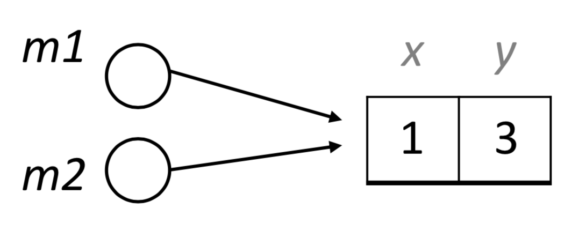

# Java style and advanced Java

## Primitive and Reference Types
- Primitive Types
  - Complete list: `byte, short, int, long, char, float, double, boolean`
- Reference Types:
  - Everything else: objects and arrays
  - Objects (of a reference type) and all arrays are stored in the heap
  - All references are the same size

### In General
- Values of primitive types are stored directly - Local variables in the stack frame
  - Object attributes in the object - Array values in the array
- Objects and arrays are stored by reference - References for local variables in the stack frame
  - References for object attributes in the object
  - Arrays of reference types are arrays of references
    - A 2-D array of Strings is an array of references to arrays of references to Strings

## Value semantics
- *Value semantics*: Values (of primitive types) are copied when assigned to each other or passed as parameters.
  - Modifying the value of one variable does not affect others.
```
    int x = 5;
    int y = x;    //  x = 5, y = 5
    y = 17;       //  x = 5, y = 17
    x = 8;        //  x = 8, y = 17
```

## Reference semantics
- *Reference semantics*: Variables store the reference to an object in the heap.
  - When one variable is assigned to another, the object is not copied; both variables refer to the same object.
```java
class MyClass {int x; int y; }

MyClass m1 = new MyClass();
m1.x = 1;
m1.y = 2;
MyClass m2 = m1;
m2.y = 3;
System.out.println(m1.y); // 3
```




## Cautions
Be aware of reference semantics.
- Consider using *value types*.
  - A value type is one that “plays the role” of a primitive type even if it is a reference type
  - A value type is one where instances cannot be changed after being constructed.
  - `String` is a value type.
- ``==`` comparison works for:
  - primitive types
  - enums
  - some other special cases (**<ins>not</ins>** including Strings)
- Otherwise, use `.equals()`
  - use `s1.equals(s2)` to compare Strings for equality
    - This is true if the two strings are the same sequence of characters
  - `s1 == s2` is only true if s1 and s2 are the same `String object`
- Make a copy if / when you need to.
  - Use a “copy” constructor for objects.
  - Typical use-case: You are returning the value of a private, non-value type attribute that the caller cannot be allowed to modify. This is called a defensive copy!

## Garbage Collection
### Dynamic Memory (Java)
- The Stack and global variables can contain primitive types and references to objects of reference types.
- The data for all reference types are stored in the Heap.
- Objects stored in the Heap can contain references to other objects in the Heap.

### Terminology
- Allocated Objects
  - Objects allocated by the program and still in the heap
- Reachable Objects
  - Objects that are still reachable by following references from the the stack and global variables
- Live Objects
  - Objects the program might actually use in the future
- Syntactic garbage
  - Allocated objects that are not reachable
- Semantic garbage
  - Reachable objects that are not live

### Manual Memory Management
- C, C++, Ada (and others) use manual memory management
- In those languages, your program must explicitly deallocate (free, delete) memory for objects allocated on the heap.
  - Doing this correctly is hard.

#### Manual Memory Management Correctness
- Your program is correct as long as objects are deallocated:
  - After the object becomes semantic garbage - Before the object becomes syntactic garbage
- Once an object becomes syntactic garbage, you no longer have a reference to it to use to deallocate it.
- Error 1: Failing to free something before it becomes syntactic garbage.
  - Do enough of this and sooner or later you run out of memory.
  - This is known as a memory leak.
- Error 2: Freeing something that is still live.
  - Oh \*&#\*! Prepare for a strange and spectacular failure.
  - This is known as a *dangling pointer*.

### What is Garbage Collection (GC)?
- Automatic reclamation of syntactic garbage Why syntactic garbage?
  - Because a program can decide whether or not something is syntactic garbage.
  - In general, you can’t decide (It is mathematically, theoretically impossible!) whether or not something is semantic garbage.
- This requires knowing all possible future behaviors of the program. Java uses GC
  - The JVM tracks everything allocated on the heap and knows how to trace all the references.

### How to you do GC?
#### Basic Approach: Mark and Sweep
- Simple version:
  - Periodically, stop everything you are doing (*stop the
world*).
  - Starting at the roots, recursively mark all objects that are
reachable.
  - Anything that was not marked is garbage and is swept up and deallocated.
- Some well known users (maybe): - Java, C#, Go
  - Lisp/Scheme
  - Python to recover circular garbage
