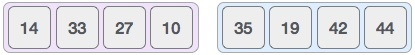

# Mergesort


- *Mergesort* is a <a href="../algorithms/divide_and_conquer.md">divide-and-conquer</a> algorithm. It continuously divides an array into two halves, recurses on both the left subarray and right subarray and then merges the two sorted halves
- Stable: `Yes`
- Time Complexity:
  - Best Case: O(nlog(n))
  - Worst Case: O(nlog(n))
  - Average Case: O(nlog(n))


## Complexity

As merge sort is a recursive algorithm, the time complexity can be expressed as the following recursive relation:
1

T(n) = 2T(n/2) + O(n)

2T(n/2) corresponds to the time required to sort the sub-arrays and O(n) time to merge the entire array.

When solved, the time complexity will come to O(nLogn).

This is true for the worst, average and best case since it will always divide the array into two and then merge.

The space complexity of the algorithm is O(n) as we’re creating temporary arrays in every recursive call.

## How it works
To understand merge sort, we take an unsorted array as the following:


We know that merge sort first divides the whole array iteratively into equal halves unless the atomic values are achieved. We see here that an array of 8 items is divided into two arrays of size 4.



This does not change the sequence of appearance of items in the original. Now we divide these two arrays into halves.


We further divide these arrays and we achieve atomic value which can no more be divided.


Now, we combine them in exactly the same manner as they were broken down. Please note the color codes given to these lists.

We first compare the element for each list and then combine them into another list in a sorted manner. We see that 14 and 33 are in sorted positions. We compare 27 and 10 and in the target list of 2 values we put 10 first, followed by 27. We change the order of 19 and 35 whereas 42 and 44 are placed sequentially.


In the next iteration of the combining phase, we compare lists of two data values, and merge them into a list of found data values placing all in a sorted order.


After the final merging, the list should look like this:


## Implementation
```java
// example of merge sort in Java
// merge function take two intervals
// one from start to mid
// second from mid+1, to end
// and merge them in sorted order

void merge(int Arr[], int start, int mid, int end) {
	// create a temp array
	int temp[] = new int[end - start + 1];
	// crawlers for both intervals and for temp
	int i = start, j = mid+1, k = 0;

	// traverse both arrays and in each iteration add smaller of both elements in temp
	while(i <= mid && j <= end) {
		if(Arr[i] <= Arr[j]) {
			temp[k] = Arr[i];
			k += 1; i += 1;
		}
		else {
			temp[k] = Arr[j];
			k += 1; j += 1;
		}
	}

	// add elements left in the first interval
	while(i <= mid) {
		temp[k] = Arr[i];
		k += 1; i += 1;
	}

	// add elements left in the second interval
	while(j <= end) {
		temp[k] = Arr[j];
		k += 1; j += 1;
	}

	// copy temp to original interval
	for(i = start; i <= end; i += 1) {
		Arr[i] = temp[i - start]
	}
}

// Arr is an array of integer type
// start and end are the starting and ending index of current interval of Arr
void mergeSort(int Arr[], int start, int end) {
	if(start < end) {
		int mid = (start + end) / 2;
		mergeSort(Arr, start, mid);
		mergeSort(Arr, mid+1, end);
		merge(Arr, start, mid, end);
	}
}
```

[Baeldung: Mergesort](https://www.baeldung.com/java-merge-sort)
